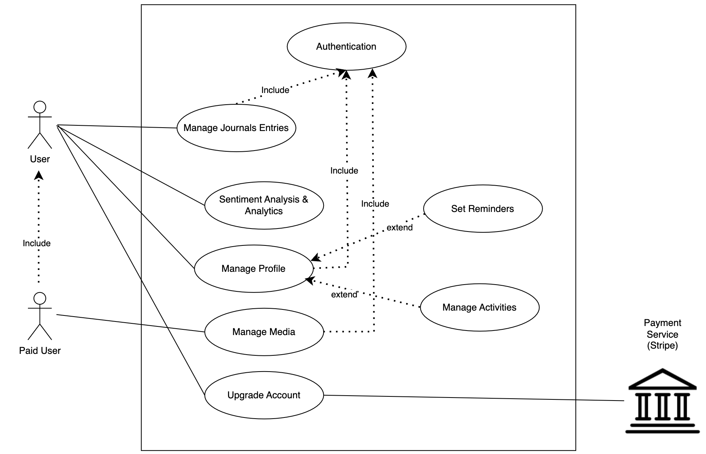
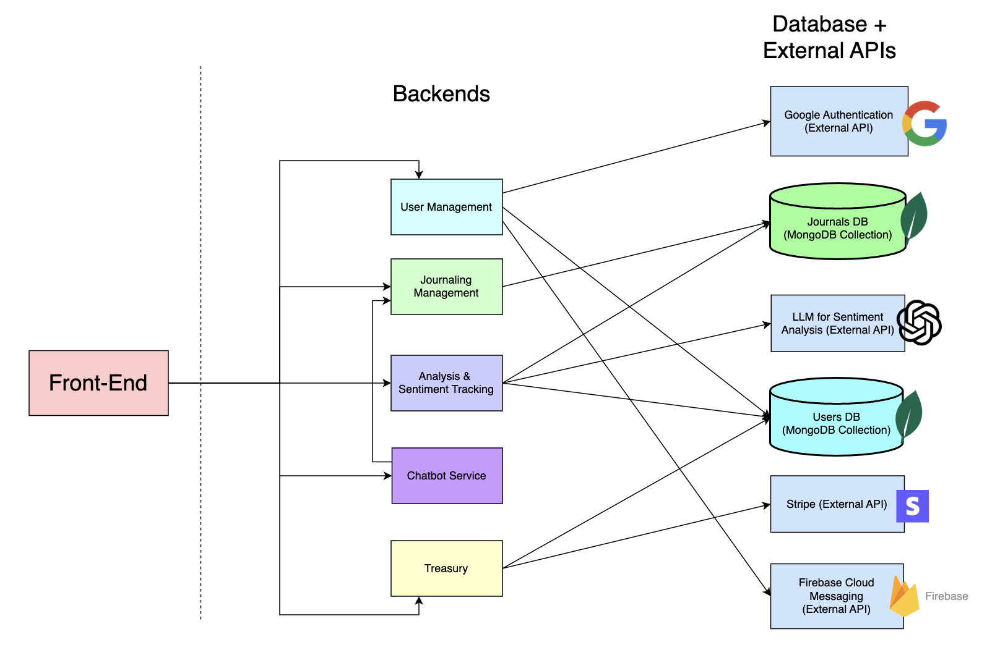
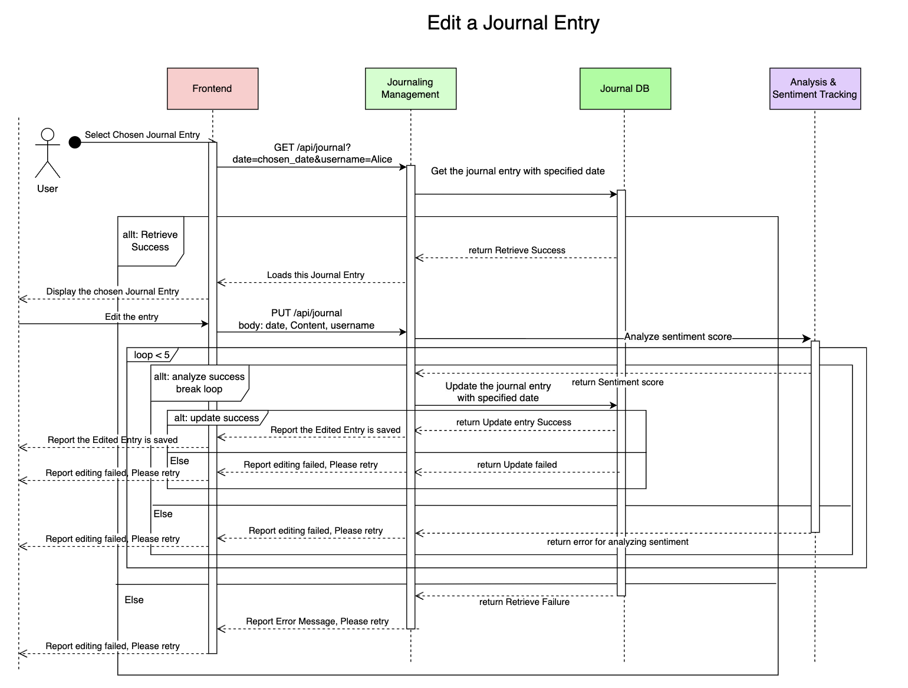
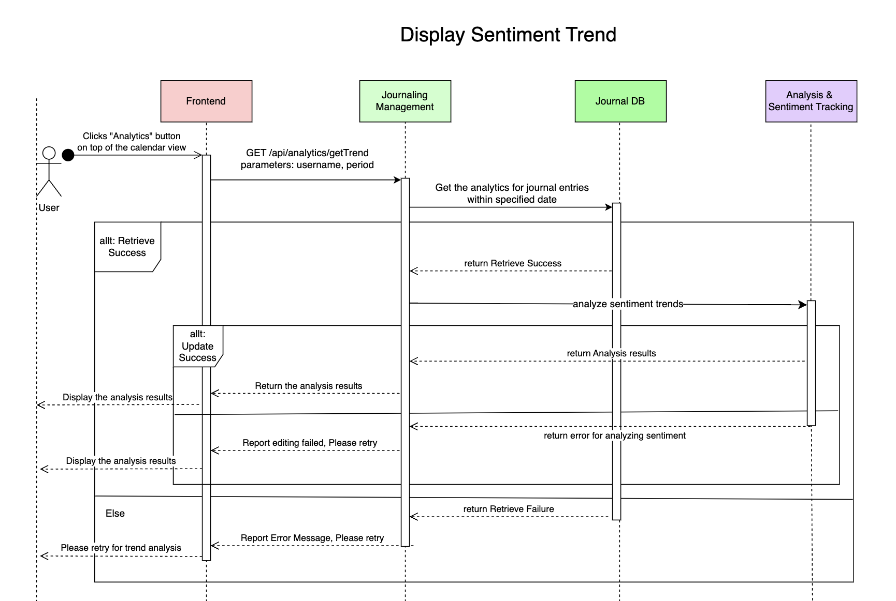
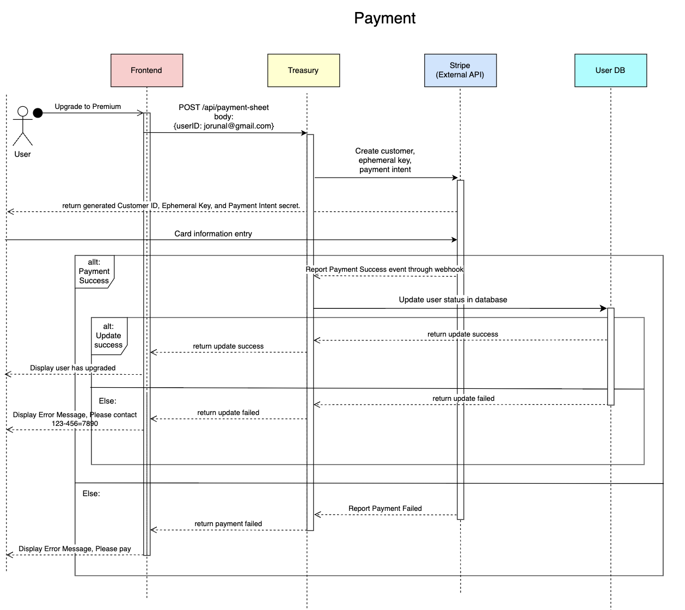
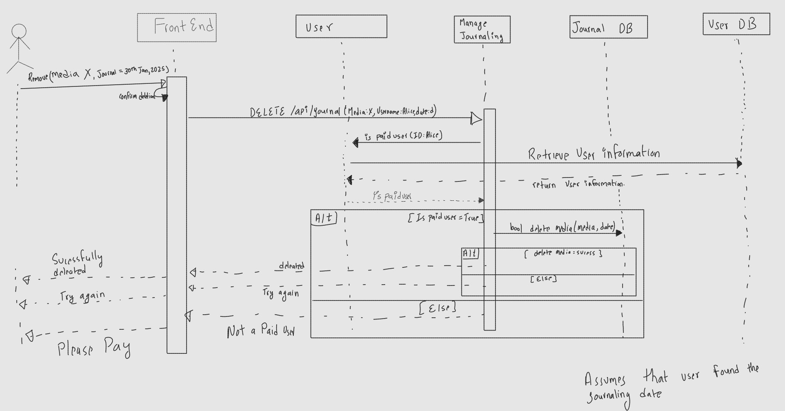

# M3 - Requirements and Design

## 1. Change History

| date    | modified section(s) | rationale for the modification|
| -------- | ---------------- |--------------|
| Feb. 12th  |  Functional Requirements, Databases, Designs Specification| Correct the errors mentioned in our Milestone 3 grading|
| Feb. 25th | Designs Specification    | Updated function interface agreement of user and journal sections based on the actual implementation |
| Feb. 28th    | Designs Specification   | Added authorization header checks for users, hence the update |
| Mar. 1st | Functional Requirements| Updated based on implementation |
| Mar. 2nd | Non-functional requiresments, Sequence Diagram, Dependency Diagram  | Updated based on implementation |

## 2. Project Description
Journal - Journey with the Bot is an unique journaling and mental health companion application designed to help users track their moods, engage in self-reflection, and manage stress effectively. Unlike traditional journaling apps, our platform integrates an AI-powered therapy bot that provides sophisticated prompts, emotional support, and personalized feedback. By analyzing user entries and mood trends, the app encourages healthier emotional habits and enhances mental well-being.


## 3. Requirements Specification
### **3.1. Use-Case Diagram** 


### **3.2. Actors Description**
1. **Users**: The primary actor of the application. "Users" can authenticate, manage entries, perform sentiment analysis, update their profile, and make payments.
2. **Paid Users**: It is a secondary actor and upgraded version of the "User" actor. It inherits all "User" functionalities except the payment use case and additionally allows media uploads in journal entries.


### **3.3. Functional Requirements**
<a name="fr1"></a>

1. **Manage Journals Entries**
    - **Overview**:
    1. Create entries: The new entries are created on the date that is either on the past or present. Both the primary and secondary user is able to do this task
    2. Edit entries: The entries that exist are modified in any way the user pleases. Both the primary and secondary user is able to do this task.
    3. Export journal: All the entries that exists in the databases are converted to the format user wants and user is able to use url to download it. Both the primary and secondary user is able to do this task
    4. Delete entry: The user is able to clear their journal entry. Both the primary and secondary user is able to do this task

    - **Detailed Flow for Each Independent Scenario**:
    1. **Create**
        - **Description**: Create a Journal Entry
        - **Primary actor(s)**: User, Paid User
        - **Main success scenario**: 
        1. The user clicks on a unhighlighted date
        2. The user is prompted to chat with the RASA bot
        3. The user is prompted to journal
        4. The user types and replies their journal entry to the chatbot
        5. The user presses back button to save their changes
        5. The calendar view is updated to highlight the day indicating it is journaled
        - **Failure scenario(s)**: 
        - 1a. User clicks on the future date
            - 1.a1 The future date is unclickEnable
            - 1.a2 A toast is generated that says "Cannot add a journal for future dates!" as a prompt to the user
        - 2a. The Chatbot does not prompt the user to write the journal and loses connection
            - 2.a1 The system displays the error and prompts the user to try again
    
    2. **Edit**
        - **Description**: Edit an existing journal entry.
        - **Primary actor(s)**:  User, Paid User
        - **Main success scenario**: 
        1. The user selects a highlighted date.
        2. The saved journal entry is loaded.
        3. The user then clicks edit button to modify the text.
        4. The user then clicks on save button to save the journal entry
        - **Failure scenario(s)**: 
        - 1a. The saved journal entry fails to load.
            - 1a1. The system displays the error saying failed to fetch and prompts the user to retry
        - 4a. The journal entry fails to be saved
            - 4a1. The system displays the error saying failed to save and displays the error.

    3. **Export**
        - **Description**: Export all the Journal Entries as PDF or CSV file.
        - **Primary actor(s)**:  User, Paid User
        - **Main success scenario**:
        1. The user selects a highlighted date that already has a journal entry 
        2. The user clicks the export button.
        2. The chatbot asks for the preferred export format PDF or CSV.
        3. The user selects a format.
        4. The download url link is copied to user's clipboard.
        - **Failure scenario(s)**:
        - 2a. User clicks the Export button, but nothing happens.
            - 2a1.  The system displays an error message & prompts the user to try again.
        - 4a. The url of the download is not copied to clipboard
            - 4a1. The system displays the error message and prompts the user to try again

    4. **Delete**
        - **Description**: Delete a journal entry.
        - **Primary actor(s)**:  User, Paid User
        - **Main success scenario**:
        1. The user selects a highlighted date with journal entry.
        2. The Delete button is clicked.
        3. The system asks if a user would like to proceed?
        4. The user confirms, and the entry is permanently removed.
        5. The calendar view updates to remove the journaled indicator.
        - **Failure scenario(s)**:
        - 4a. User confirms deletion, but the journal entry is not removed from the database.
            - 4a1.  The system notifies the user about the issue and suggests retrying.
        - 5a. The calendar view does not update after deletion.
            - 5a2. If unsuccessful, the user is asked to reload the page manually.


2. **Sentiment Analysis & Analytics**
    - **Overview**:
    Journal Entries stored on the db are analyzed the text and a sentiment score is generated.

    - **Detailed Flow for Each Independent Scenario**:
    1. **Compute Sentiment Score (Backend)**
        - **Description**: Sentiment Analysis and Generate Score.
        - **Primary actor(s)**: ML Model or API (depending on complexity)
        - **Main success scenario**: 
        1. When a user creates or edits a journal entry, the system automatically analyzes the sentiment of the text.
        2. The sentiment score is stored in the database alongside the journal entry.

        - **Failure scenario(s)**:
        -1a. User submits an entry, but the sentiment analysis process fails.
            -1a1. The system logs the issue and retries the analysis.

        - 2a. Sentiment score is generated but not stored in the database
            -2a1. The system attempts to resave the data
            -2a2.  If resaving fails, an error message is displayed.

    2. **Display Sentiment Trends in Analytics**
        - **Description**: Display an overview of the user’s mood over a period of time.
        - **Primary actor(s)**: User, Paid User
        - **Main success scenario**: 
        1. The user clicks on the Analytics button on top of the calander.
        2. visual graphs of sentiment trends over a period of time is then displayed.
        3. User is able to chose Monthly/weekly, Pie Chart, Frequently used words in entries, etc..
        - **Failure scenario(s)**: 
        - 1a. User clicks Analytics, but sentiment data retrieval fails
           - 1a1. The system retries fetching data.
           - 1a2. If unsuccessful, an error message is displayed.

        - 2a. User attempts to view a chart, but does not render
           - 2a1. The system refreshes the UI and attempts to reload the chart.

        - 3a. User does not have enough journal entries for meaningful analysis.
           - 3a1. A message informs the user that more entries are needed.
           - 3a2. The system suggests journaling more frequently.

3. **Manage Profile** 
    - **Overview**:
        The user can change their reminder in manage profile
        
    - **Detailed Flow for Each Independent Scenario**: 
        1.  **Update Reminder Settings**:
            - **Description**: The user can update the app's reminder settings to notify the user to write journals.
            - **Primary actor(s)**: User, Paid User
            - **Main success scenario**:
                    1. User clicks on the profile icon.
                    2. System display the user profile and the current reminder settings to the user. (For new users, the current reminder settings are set to all none for weekdays, and it will display current time on the user's device)
                    3. User changes the reminder settings and click "Save Settings".
                    4. Update success message is displayed on the app.
            - **Failure scenario(s)**:
                - 2a. System fails to retrieve user data.
                    - 2a1. An error message is displayed for retrieving user data
                    - 2a2. System prompts user to retry
                - 3a. Failure to change reminder settings
                    - 3a1. An error message is displayed for failue to  update reminder settings
        2. **Update Preferred Name**:
            - **Description**: The user can update their preferred name to be called inside the Journal app.
            - **Primary actor(s)**: User, Paid User
            - **Main success scenario**:
                    1. User clicks on the profile icon.
                    2. System display the user profile and preferred name to the user.
                    3. User changes their Preferred Name and click "Save Settings".
                    3. Update success message is displayed on the app.
            - **Failure scenario(s)**:
                - 2a. System fails to retrieve user data.
                    - 2a1. An error message is displayed for retrieving user data
                    - 2a2. System prompts user to retry
                - 3a. Failure to change preferred name of the user
                    - 3a1. An error message is logged for failure to update preferred name
        3. **Update Activities Tracking**:
            - **Description**: The user can update the app's activity tracking settings to notify the user to write journals.
            - **Primary actor(s)**: User, Paid User
            - **Main success scenario**:
                    1. User clicks on the profile icon.
                    2. System display the user profile and activity tracking settings to the user.
                    3. User changes the activities tracking settings and click update. (this change action includes add, edit/delete by holding on to an activity)
                    3. Update success message is displayed on the app.
            - **Failure scenario(s)**:
                - 2a. System fails to retrieve user data.
                    - 2a1. An error message is displayed for retrieving user data
                    - 2a2. System prompts user to retry
                - 3a. Failure to change activity tracking settings
                    - 3a1. An error message is logged for failure to update activities tracking settings

4. **Authentication** 
    - **Overview**:
        1. Authenticate User: The User authenticates and creates an account
    
    - **Detailed Flow for Each Independent Scenario**: 
        1. **Authenticate User**:
            - **Description**: The actor authenticates using their Google account
            - **Primary actor(s)**: User, Paid User
            - **Main success scenario**:
                1. User presses "Log in" button
                2. User is prompted to type in their google account information (Email followed by password); Or if user has typed in their google account information previously, they will be prompted to choose an account to log in
                3. User is authenticated and enters the calendar view page
            - **Failure scenario(s)**:
                - 2a. User types in wrong information
                    - 2a1. The authentication API displays an error message telling the user of the error and potential solution.
                    - 2a2. The authentication pop up prompts the user to try again
                - 3a. User typed in correct information, but failed to authenticate at the server side
                    - 3a1. User will remain at the log in view; An error message is displayed for authenticating the user
                    - 3a2. System prompts user to retry authentication
    
5. **Manage Media** 
    - **Overview**:
        1. Adding media to the entry: Users can attach media files to the journal entries
        2. Removing media from the entry: Users can remove attached media files from a journal entry
    
    - **Detailed Flow for Each Independent Scenario**: 
        1. **Adding media to the the entry**:
            - **Description**: The user should be able to attach photos or videos to their journal entry from their phone storage or directly by using the devices's camera
            - **Primary actor(s)**: Paid User
            - **Main success scenario**:
                1. The user selects a journal entry
                2. The user clicks on the "Attachment icon" button
                3. The system prompts user to select media from device or capture a new photo using the device's camera
                4. The user selects one of the following option
                5. The media is uploaded
                6. The user clicks the save entry button to save the picture
            - **Failure scenario(s)**:
                - 4a. User selects an unsupported file format
                    - 3a1. An error message is displayed: "Unsupported file format: Please select a following file format: JPG, PNG, JPEG"
                    - 3a2. The user is prompted to try again with a valid file format
                - 4b. The device doesn't have enough storage
                    - 3b1. The user clicks on to capture a new media
                    - 3b2. An error message is displayed: "The storage is full, please free up space"
                - 5a. The media is not successfully uploaded
                    - 5a1. An error is displayed: "The media was not successfully uploaded. Try again"
                    - 5a2. The user is prompted to try again 

        2. **Removing media from the entry**:
            - **Description**: The user should be able to remove previously attached media from their journal entries.
            - **Primary actor(s)**: Paid User
            - **Main success scenario**:
                1. The user selects a journal entry containing attached media
                2. The user clicks on the media
                3. System displays a pop-up: "do you want to delete"
                4. The user confirms their choice
                5. The system removes the media from the journal entry
                6. The user clicks on the save entry button
            - **Failure scenario(s)**:
                - 2a. Media is already deleted or missing
                    - 5a1. The system displays an error: "File not found"
                    - 5a2. The user is prompted to check the presence of media in the journal entry
                - 4a. User mistakenly deleted the media and would like to recover it
                    - 4a1. The system provides an Undo option for 20 seconds after it is deleted  
                    - 4a2. If the user does not undo, the media is removed from the journal
                - 5a. The media is not successfully deleted
                    - 5a1. An error is displayed: "The media was not successfully deleted. Try again"
                    - 5a2. The user is prompted to try again

3. **Upgrade Account** 
    - **Overview**:
        1. Upgrade account using Stripe's payment method: The user is able to upgrade their membership to attach images to their journals. They would be a paid user after they upgrade the account.
    
    - **Detailed Flow for Each Independent Scenario**: 
        1. **Upgrade account using third-party payment method**:
            - **Description**: User should be able to use Stripe's payment option to upgrade account status of their account to enable adding images to journal entries.
            - **Primary actor(s)**: User
            - **Main success scenario**:
                1. User clicks "Profile" button, enters their profile page view
                2. User clicks "Upgrade" button beside "Account status: Free"
                3. A payment sheet from Stripe is displayed on the profile page, and user is prompted to select their desired payment method and enter their payment information.
                4. The payment is approved by Stripe, and a green check mark is displayed at the bottom of the payment sheet
                5. The user's account status has been upgraded to "Premium".
                It will also mention the perks that come with it and a short set of instructions.
            - **Failure scenario(s)**:
                - 1a. The server failed to retrieve user's profile
                    - 1a1. An error message is displayed
                    - 1a2. The system prompts the user to check internet connectivity and retry
                - 2a. The server failed to retrieve the payment-sheet resources
                    - 2a1. An error message is displayed
                    - 2a2. The system prompts the user to try upgrade their account after several hours
                - 3a. There is an error with the third-party payment and it returns as not completed.
                    - 3a1. The user is notified of the transaction failure and the type high-level error if that is returned.
                    - 3a2. The system prompts the user to check their account, and prompts the user to call customer service 123-456-7890 if there is any financial lost.
                    to call 123-456-7890
                - 4a. The user's account fails to upgrade
                    - 4a1. The system prompts the user to call customer service 123-456-7890 for support.


### **3.4. Screen Mockups**


### **3.5. Non-Functional Requirements**
<a name="nfr1"></a>

1. **Entry Encryption**
    - **Description**: User entries will be stored in an external database encrypted with AES protocol
    - **Justification**: Encrypting user data as an extra layer of security will make more people willing to choose our application to save all of their sensitive personal information. Protecting this information is also extremely important from a privacy/ethics point of view, along with for the safety of users as well.
2. **Response Times**
    - **Description**: 
        - Operations for managing journal entries should be completed within 2 seconds when the server is available.
        - Sentiment analysis API should take within 20 seconds.
        - Chat bot responses should be fetched within 5 seconds.
    - **Justification**: Fast response times are crucial for a smooth user experience. Waiting a maximum of 5 seconds for a prompt for writing sounds reasonable along with max 20 seconds for analysis to be done after an entry is created as it will already take some time for the user to navigate to the menu if they wanted to see progress tracking of the app. For operations involving journal entries, people will probably want something a bit more responsive since they might want to look through multiple past journal entries.

3. **Usability**
    - **Description**: 
        - Operations for users managing journal entries should take less than 3 clicks.
    - **Justification**: Minimizing the number of clicks required to perform operations makes it so that the user can get to adding or viewing journal entries quickly so that people who are more impulsive for entries are more likely to remain consistent with journaling.


## 4. Designs Specification
### **4.1. Main Components**
1. **User Management**
    - **Purpose**: Handles user authentication (via Google/Facebook), and profile management.
    - **Interfaces**: 
        1. Get /api/profile
            - **Purpose**: Retrieve a user's profile information.
            - **Request Parameters**: userID: Required, string.
            - **Response**:
            - Status Code: 201 Created
                Response Body:
                ```
                {
                    "isPaid": "boolean",
                    "reminderSetting": "object",
                    "preferred_name": "string",
                    "activities_tracking": ["string"],
                    "userReminderTime": ["string"],
                    "createdAt": "string",
                    "fcmToken": "string",
                    "timeOffset": "string",
                    "googleNumID": "string"
                }
                ```
            - Status Code: 404 Not Found
            Response Body:
            ```
            {
                "error": "User not found"
            }
            ```
            - Status Code: 500 Internal Server Error
        2. Get /api/profile/isPaidUser
            - **Purpose**: Check if a user is a paid member.
            - **Request Parameters**: userID: Required, must be a string.
            - **Response**:
            - Status Code: 200 OK
                Response Body:
            ```
            {
                "isPaid": "boolean"
            }
            ```
            - Status Code: 404 Not Found
            Response Body:
            ```
            {
                "error": "User not found"
            }
            ```
            - Status Code: 500 Internal Server Error

        3. POST /api/profile
            - **Purpose**: Create or update a user profile.
            - **Request Body**:
            ```
            {
                "userID": "string",
                "googleToken": "string",
                "isPaid": "boolean (optional)",
                "preferred_name": "string (optional)",
                "activities_tracking": ["string (optional)"]
            }
            ```
            - **Response**:
                - Status Code: 201 Created or 200 OK
                    Response Body:
                    ```
                    {
                        "message": "User profile created/updated successfully",
                        "updatedFields": "object"
                    }
                    ```
                - Status Code: 500 Internal Server Error
        4. POST /api/profile/fcmtoken
            - **Purpose**: Store or update a user's FCM (Firebase Cloud Messaging) token.
            - **Request Body**:
            ```
            {
                "userID": "string",
                "fcmToken": "string",
                "timeOffset": "string"
            }
            ```
            - **Response**:
                - Status Code: 200 OK
                    Response Body:
                    ```
                    {
                        "success": true
                    }
                    ```
                - Status Code: 500 Internal Server Errors
        
        5. POST /api/profile/reminder
            - **Purpose**: Change or update a user's reminder settings.
            - **Request Body**:
            ```
            {
                "userID": "string",
                "updated_reminder": {
                    "Weekday": ["integer"],
                    "time": "string (HH:mm)"
                }
            }
            ```
            (Note: Weekday field uses integers 1-7 to represent weekdays from Monday to Sunday)
            - **Response**:
            - Status Code: 200 OK
                Response Body:
                ```
                {
                    "update_success": true
                }
                ```
            - Status Code: 500 Internal Server Errors

2. **Journaling Management**
    - **Purpose**: Handles the management (create, edit, delete, export) of the Journal. Also handles the addition of media to the journal.
    - **Interfaces**: 
        1. POST /api/journal
            - **Purpose**: Create a new journal entry for a specific user on a given date.
            - **Headers**: Authorization (Header): Required, in the format Bearer \<googleToken>.
            - **Request Body**:
            ```
            {
                "date": "string (ISO8601 format)",
                "userID": "string" (required),
                "text": "string (optional)",
                "media": ["string (Base64 encoded images) (optional)"]
            }
            ```
            - **Response**:
                - Status Code: 201 Created
                    Response Body:
                    ```
                    {
                        "message": "New journal entry created successfully with images!"
                    }
                    ```
                - Status Code: 400 Bad Request
                    Response Body:
                    ```
                    {
                        "message": "Journal entry already exists for this date"
                    }
                    ```
                - Status Code: 500 Internal Server Error

        2. GET /api/journal
            - **Purpose**: Retrieve a journal entry for a specific user on a given date.
            - **Headers**: Authorization (Header): Required, in the format Bearer \<googleToken>.
            - **Request Parameters**:
                - date: Required, ISO8601 formatted string.
                - userID: Required, string.
            - **Response**: 
                - Status Code: 200 OK
                Response Body:
                ```
                {
                    "journal": {
                        "text": "string",
                        "media": ["string (Base64 encoded images)"]
                    }
                }
                ```
                - Status Code: 404 Not Found
                Response Body:
                ```
                {
                    "journal": {
                        "text": "",
                        "media": []
                    }
                }
                ```
                - Status Code: 500 Internal Server Error

        3. PUT /api/journal
            - **Purpose**: Update an existing journal entry for a specific user on a given date.
            - **Headers**: Authorization (Header): Required, in the format Bearer \<googleToken>.
            - **Request Body**:
            ```
            {
                "date": "string (ISO8601 format)",
                "userID": "string",
                "text": "string (optional)",
                "media": ["string (Base64 encoded images) (optional)"]
            }
            ```
            - **Response**:
            - Status Code: 200 OK
                Response Body:
                ```
                {
                    "update_success": true
                }
                ```
            - Status Code: 500 Internal Server Error
        4. DELETE /api/journal
            - **Purpose**: Delete a journal entry for a specific user on a given date.
            - **Headers**: Authorization (Header): Required, in the format Bearer \<googleToken>.
            - **Request Parameters**:
                date: Required, ISO8601 formatted string.
                userID: Required, string.
            - **Response**:
            - Status Code: 200 OK
                Response Body:
                ```
                {
                    "delete_success": true
                }
                ```
            - Status Code: 500 Internal Server Error
        5. POST /api/journal/media
            - **Purpose**: Adds images to an existing journal entry. If no entry exists, a new one is created.
            - **Headers**: Authorization (Header): Required, in the format Bearer \<googleToken>.
            - **Request Body**:
            ```
            {
                "date": "string (ISO8601 format)",
                "userID": "string",
                "media": ["string (Base64 encoded images) (optional)"]
            }
            ```
            - **Response**:
                - Status Code: 201 Created
                    Response Body:
                    ```
                    {
                        "success": true
                    }
                    ```
                - Status Code: 400 Bad Request
                    Response Body:
                    ```
                    { "message": "No media provided" }
                    { "message": "Invalid media format" }
                    ```
                - Status Code: 500 Internal Server Error
        6. DELETE /api/journal/media
            - **Purpose**: Deletes a specific media item from a journal entry.
            - **Headers**: Authorization (Header): Required, in the format Bearer \<googleToken>.
            - **Request Parameters**:
                date: Required, ISO8601 formatted string.
                userID: Required, string.
                media: Required, string. The Base64 encoded media to be deleted.
            - **Response**:
                - Status Code: 200 OK
                    Response Body:
                    ```
                    { "delete_success": true } - If the media was deleted.
                    { "delete_success": false } - If the media was not found.
                    ```
                - Status Code: 400 Bad Request
                    Response Body:
                    ```
                    { "message": "Invalid or no media specified for deletion" }
                    ```
                - Status Code: 404 Not Found
                    Response Body:
                    ```
                    { "message": "Journal entry not found" }
                    ```
                - Status Code: 500 Internal Server Error
        7. GET /api/journal/media
            - **Purpose**: Retrieves all media of a journal entry on a specific date.
            - **Headers**: Authorization (Header): Required, in the format Bearer \<googleToken>.
            - **Request Parameters**:
                - date: Required, ISO8601 formatted string.
                - userID: Required, string.
            - **Response**: 
                - Status Code: 200 OK
                Response Body:
                ```
                { "media": [strings of Base64 encoded images] }
                ```
                - Status Code: 404 Not Found
                Response Body:
                ```
                { "message": "Journal entry not found" }
                ```
                - Status Code: 500 Internal Server Error
        8. GET /api/journal/file
            - **Purpose**: Generates a file (PDF or CSV) containing all journal entries for a user.
            - **Headers**: Authorization (Header): Required, in the format Bearer \<googleToken>.
            - **Request Parameters**:
                - date: Required, ISO8601 formatted string.
                - format: Required, either "pdf" or "csv".
            - **Response**: 
                - Status Code: 200 OK
                Response Body:
                ```
                {
                    "filename": "generated-file-name.pdf",
                    "downloadURL": "https://our_ec2_instance.com/public/generated-file-name.pdf"
                }
                ```
                - Status Code: 400 Bad Request
                Response Body:
                ```
                { "message": "Invalid format. Only 'pdf' or 'csv' are accepted." }
                ```
                - Status Code: 403 Forbidden
                Response Body:
                ```
                { "message": "Invalid Google token." }
                { "message": "Unauthorized access." }
                ```
                - Status Code: 404 Not Found
                Response Body:
                ```
                { "message": "No journal entries found for this user." }
                ```
                - Status Code: 500 Internal Server Error
3. **Analysis & Sentiment Tracking**
    - **Purpose**: Analyze and tracks the user's mood to get a trend over a certain period of time
    - **Interfaces**: 
        1. GET /api/analytics/getTrend
            - **Purpose**: Get the user's sentiment trend over a certain period of time
            - **Request Parameters**: Username, (optional) period: ENUM (WEEK, MONTH, YEAR). get the sentiment trend within a period. Default period includes all entries.
            - **Response Body**: return the user's sentiment date within the specified period.
        2. POST /api/analytics/suggestion
            - **Purpose**: Get a suggestion based on the user's trend within a week
            - **Request Body**:
            ```
            {
                "userID": "string"
            }
            ```
            - **Response Body**: the chatbot's suggestion.
4. **Treasury**
    -  **Purpose**: Allows users to securely make payments through Stripe within the application, while ensuring a seamless and secure transaction flow.
    - **Interfaces**:
        1. POST /api/payment-sheet
            - **Purpose**: Create a PaymentIntent and associated Ephemeral Key for a customer, enabling the user to initiate a payment through Stripe.
            - **Request Body**:
            ```
            {
                "userID": "string"
            }
            ```
            - **Response**:
            - Status Code: 200 OK
                Response Body:
                ```
                {
                "paymentIntent": "string", Client secret for the PaymentIntent
                "ephemeralKey": "string", Secret for the Ephemeral Key
                "customer": "string", Customer ID created in Stripe
                "publishableKey": "string", Publishable key for Stripe SDK
                "userID": "string" The userID passed in the request
                }
                ```
            - Status Code: 400 Bad Request
                Response Body:
                ```
                {
                "message": "Invalid request data"
                }
                ```
            - Status Code: 500 Internal Server Errors
                Response Body:
                ```
                {
                "message": "Failed to create PaymentIntent"
                }
                ```
        2. POST /webhook
            - **Purpose**: Handle Stripe Webhook events to process payment results and update the user’s payment status in the database.
            - **Request Body**:
                - Stripe sends the event payload, which varies depending on the event type.
                For payment_intent.succeeded:
            ```
            {
            "id": "evt_1XYZ...",
            "object": "event",
            "type": "payment_intent.succeeded",
            "data": {
                "object": {
                "id": "pi_1XYZ...",
                "amount": 1099,
                "currency": "cad",
                "metadata": {
                    "userID": "string"
                }
                }
            }
            }
            ```
            - **Response**:
            - Status Code: 200 OK
                Response Body:
                ```
                {
                "message": "Webhook event processed successfully"
                }
                ```
            - Status Code: 400 Bad Request
                Response Body:
                ```
                {
                "message": "Invalid event format"
                }
                ```
            - Status Code: 500 Internal Server Errors
                Response Body:
                ```
                {
                "message": "Failed to process event"
                }
                ```


### **4.2. Databases**
1. **Journals DB (MongoDB Collection)**
    - **Purpose**: Stores user journal entries and images in data url formats.
2. **Users DB (MongoDB Collection)**
    - **Purpose**: Stores user profile along with reminder settings.


### **4.3. External Modules**
1. **Google Authenticator** 
    - **Purpose**: Handles the authentication, and registration of an user.
    - **Rationale**: There was a tutorial in google authentication. Everyone in group is familiar with it
    - **Interfaces**: 
        1. GET /api/authenticate
            - **Request Parameters**: Credential (Google email and password)
            - **Response Body**: Login status
2. **Stripe - Third-party payment**
    - **Purpose**: Manage a secure payment transactions using Stripe. 
    - **Rationale**: Stripe has developer-friendly APIs and is easy to learn. The alternative was Paypal which is supposedly less flexible for developers.
    - **Interfaces**: The Stripe API is integrated in the Treasury component of our app, with logic to update the user database if the server webhook receives a payment succeeded event.
3. **Sentiment Analysis - Openai API**
    - **Purpose**: Analyzes user's journal entry to determine sentiment.
    - **Rationale**: Most of the group has used the openai API previously. It is very simple to learn as well. 
    - **Interfaces**:
        1. POST /api/sentiment
            - **Request Body**: journal entry
            - **Response Body**: Sentiment score
4. **Firebase Cloud Messaging (FCM) - Reminder System**
    - **Purpose**: Sends push notifications to remind users about journal entries.
    - **Rationale**: Firebase Cloud Messaging is free and easy to integrate with both Android and backend services.
    - **Interfaces**: The FCM is integrated in the User component of our app, with /api/profile and /api/profile/reminder to sent when a user sets a reminder for journal entries. The reminder is triggered based on user's device time's selected days and time preferences stored in the database in both server time and user time.
        

### **4.4. Frameworks**
1. **Docker**
    - **Purpose**: Automate the deployment of our application
    - **Reason**: Enables easy deployment across different environments without dependency issues.
2. **MongoDB**
    - **Purpose**: Store user and journaling data
    - **Reason**: We choose to use MongoDB because it is a NoSQL database, which allows flexible storage of semi-structured journal data. We also worked with it during CPEN322/CPEN320, so all group members are familiar with it.
3. **AWS EC2**
    - **Purpose**: Cloud hosting
    - **Reason**: Enables scalable and cost-effective for hosting backend services. It is also introduced in our tutorial, so all group members are familiar with it.
4. **RASA**
    - **Purpose**: Chatbot for guided journaling.
    - **Reason**: Enables structured journaling by dynamically adjusting responses based on user input.

### **4.5. Dependencies Diagram** 


### **4.6. Functional Requirements Sequence Diagram**
1. **[Authentication]**

2. **[Create]**

3. **[Edit]**

4. **[Delete]**

5. **[Export]**

6. **[Analyze Sentiment]**

7. **[Payment]**

8. **[Set reminder]**

8. **[Remove Media]**

8. **[Add Media]**


### **4.7. Non-Functional Requirements Design**
1. **Encryption of Entries**
    - **Planned Implementation**: We will use AES-256-CBC encryption protocol to ensure all entires in the database are only viewable by the user who wrote them. A server-wide secret will act as the salt for key derivation, ensuring consistency across encryption and decryption processes. When a user needs to add or modify entries, the encryption key will be derived again from their Google Numeric ID and the server secret. The encrypted data, including the IV, will be stored in the database. During decryption, the IV is extracted from the stored data, allowing successful retrieval of the original content.


2. **Performance**
    - **Planned Implementation**: Using https to MongoDB, we can receive and transmit simple text, image and video (or database operations that surround these things), at a rate that will match. 
    For sentiment analysis, because there are multiple sentiments along with multiple variables that need to be tracked, the openai API will be used to compute weights for different emotions to later display in the "sentiment summary" screen.
    For prompting the user, we will use the SARA framework to customize our own chatbot LLM to analyze and follow a set flow of conversation and to log activities that the user reports throughout the day for statistics tracking. Using this framework will allow us to be more flexible in that it can be run much faster than an external API call.

3. **Usability**
    - **Planned Implementation**: We will make sure the buttons design flow will be within 3 click. The user would click on the entry from calendar activity, which would take the user to the entry view activity. Then the user would do their final click of manage entry to get access to the entry. Please refer to the Screen Mockups for a detailed view.


### **4.8. Main Project Complexity Design**
- **Description**: 
        Based On a custom trained chatbot that is designed to guide users through structured journal entries by dynamically adjusting its questions based on user responses. 
        It ensures that entries are meaningful, complete, and well-organized by leveraging Rasa NLU for intent classification and dialogue management.
        The chatbot must also integrate with sentiment analysis and the backend database to store journal entries.
- **Why complex?**: 
        Requires custom NLP training to recognize user intent accurately.
        Must handle custom dialogue management, adapting dynamically to different user responses.
        Needs context retention, meaning it must remember user input across multiple conversation turns.
        Requires error handling and fallback mechanisms to manage incomplete or unclear entries.
        Must integrate with sentiment analysis models to analyze the emotional tone of journal entries.
        Requires secure and efficient storage integration with the backend for saving journal entries.

- **Design**:
    - **Input**: 
        User’s journal entry responses (text or speech-to-text), 
    - **Output**: 
        A structured journal entry stored in the database.
        A sentiment score attached to the journal entry for analytics.
    - **Main computational logic**:
        Intent Classification: Determine user response category emotion, intent.
        Dialogue Management: Adjust responses and next questions dynamically in real time.
        Context Retention: Maintain conversational context and Memory across user interactions.
        Sentiment Analysis: Compute sentiment scores after post entry/completion.
        Backend Storage: Save structured journal entries to the database along with sentiment score.
    - **Pseudo-code**: 
        ```python
        def startEntry():
            # Initialize Journaling Session
            sessionData = {
                "mood": None,
                "sleep": None,
                "exercise": None,
                "stress": None,
                "goal": None,
                "socialInteraction": None,
                "sentimentScore": None,
            }

            # Step 1: Greet The User
            chatbot.say("Hi! How are you doing today, ready for your daily journaling?")
            response = user_input()

            if intent(response) in ["goodbye"]:
                chatbot.say("See you tomorrow! Bye!")
                return

            # Step 2: Ask about Mood
            chatbot.ask("How is your mood today? Yesterday you weren't all that feeling great.")
            sessionData["mood"] = user_input()

            # Step 3: Ask about sleep
            chatbot.ask("How much sleep did you get last night?")
            sessionData["sleep"] = user_input()

            # Step 4: Ask about exercise
            chatbot.ask("Did you get in exercise for the day?")
            sessionData["exercise"] = user_input()

            # Step 5: Ask about stress levels
            chatbot.ask("Is your stress level low, medium, or high?")
            sessionData["stress"] = user_input()

            # Step 6: Ask about goals for the day
            chatbot.ask("What do you want to accomplish today?")
            sessionData["goal"] = user_input()

            # Step 7: Ask about social interactions for the day
            chatbot.ask("Did you have any meaningful social interactions with anyone for the day?")
            sessionData["goal"] = user_input()

            # Step 7: Provide a summary
            chatbot.say("Here's your daily journaling log:\n" +
                        "- Mood: " + sessionData['mood'] + "\n" +
                        "- Sleep: " + sessionData['sleep'] + " hours\n" +
                        "- Exercise: " + sessionData['exercise'] + " hours\n" +
                        "- Stress: " + sessionData['stress'] + "\n" +
                        "- Goal: " + sessionData['goal'] + "\n" +
                        "- Social Interaction: " + sessionData['socialInteraction'])

            #Step 8: Save To DB
            entry = {
                "userName": userName,
                "date": getDate(),
                "mood": sessionData["mood"],
                "sleep": sessionData["sleep"],
                "exercise": sessionData["exercise"],
                "stress": sessionData["stress"],
                "goal": sessionData["goal"],
                "socialInteraction": sessionData["socialInteraction"],
                "sentimentScore": sentimentScore
            }
            saveToDB(entry)
        
## 5. Contributions
- Nyi Nyi (3-4 hours): Complexity design, database module, functional requirement, frameworks, Screen Mockups
- Christine Jiang (24 hours): Firebase cloud messaging reminder, backend for User Management, backend for journaling management, payment component, activities settings frontend, profile settings frontend, Google authentication frontend, Update Requirements and Design documentations
- Kevin Li (4-5 hours): nonfunctional requirements, nonfunctional design, functional requirement
- Amod Ghimire (5 hours): Functional requirement, sequence diagram, ector description, external modules