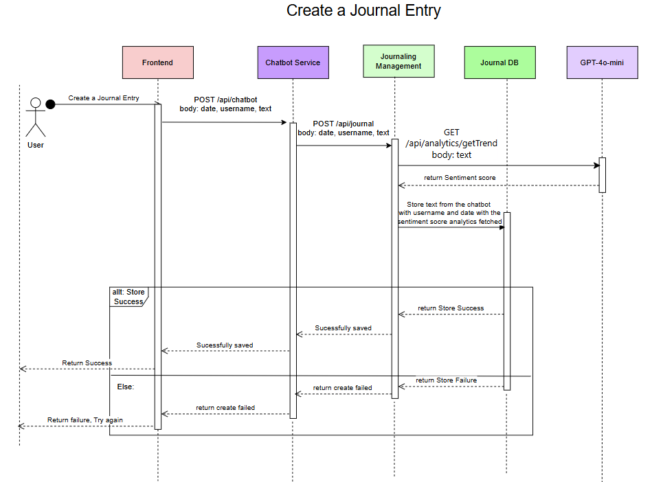
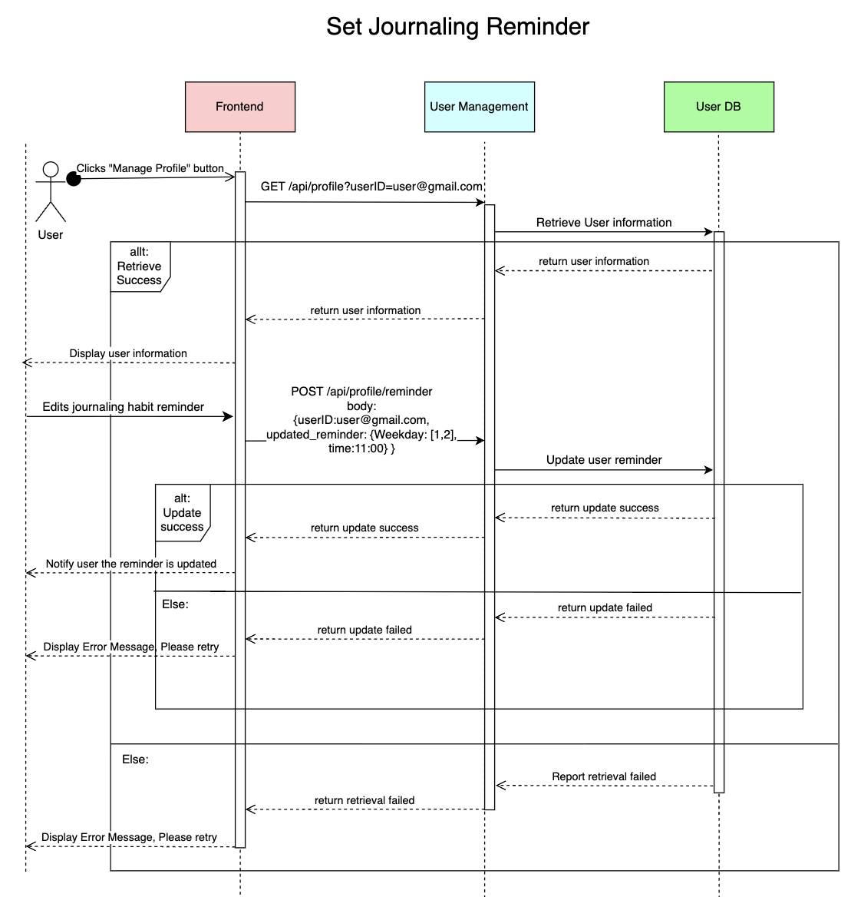

# M3 - Requirements and Design

## 1. Change History
<!-- Leave blank for M3 -->

## 2. Project Description
Journal - Therapy with the Bot is an unique journaling and mental health companion application designed to help users track their moods, engage in self-reflection, and manage stress effectively. Unlike traditional journaling apps, our platform integrates an AI-powered therapy bot that provides interactive conversations, emotional support, and personalized feedback. By analyzing user entries and mood trends, the app encourages healthier emotional habits and enhances mental well-being.


## 3. Requirements Specification
### **3.1. Use-Case Diagram** 

(feel free to change it in google drive)

- : Authentication With Google or Facebook; -A

- : Create, Delete, Edit and Export journal entries and analytics. -N

- : Mood Tracking + Past Statistics - C

- : Adding photos and videos of events to the entries. -A

- : Privacy, Manage how data is stored; Ability to delete user data;  -N

- : Payment - K

- : Manage Profile - N
    > Ability to set realistic journaling habits and provide reminders. 


### **3.2. Actors Description**
1. **Users**: The primary actor of the application. Users can authenticate, manage entries, perform sentiment analysis, update their profile, and make payments.
2. **Paid Users**: It is a secondary actor and upgraded version of the User actor. It inherits all User functionalities and additionally allows media uploads in journal entries.


### **3.3. Functional Requirements**
<a name="fr1"></a>

1. **[WRITE_FUNCTIONAL_REQUIREMENT_1_NAME_HERE]** 
    - **Overview**:
        1. [WRITE_FUNCTIONAL_REQUIREMENT_1_1_NAME_HERE]
        2. ...
    
    - **Detailed Flow for Each Independent Scenario**: 
        1. **[WRITE_FUNCTIONAL_REQUIREMENT_1_1_NAME_HERE]**:
            - **Description**: ...
            - **Primary actor(s)**: ... 
            - **Main success scenario**:
                1. ...
                2. ...
            - **Failure scenario(s)**:
                - 1a. ...
                    - 1a1. ...
                    - 1a2. ...
                - 1b. ...
                    - 1b1. ...
                    - 1b2. ...
                - 2a. ...
                    - 2a1. ...
                    - 2a2. ...

        2. ...
    
2. **[WRITE_FUNCTIONAL_REQUIREMENT_1_NAME_HERE]** 
    - **Overview**:
        1. [WRITE_FUNCTIONAL_REQUIREMENT_1_1_NAME_HERE]
        2. ...
    
    - **Detailed Flow for Each Independent Scenario**: 
        1. **[WRITE_FUNCTIONAL_REQUIREMENT_1_1_NAME_HERE]**:
            - **Description**: ...
            - **Primary actor(s)**: ... 
            - **Main success scenario**:
                1. ...
                2. ...
            - **Failure scenario(s)**:
                - 1a. ...
                    - 1a1. ...
                    - 1a2. ...
                - 1b. ...
                    - 1b1. ...
                    - 1b2. ...
                - 2a. ...
                    - 2a1. ...
                    - 2a2. ...

        2. ...
3. **[WRITE_FUNCTIONAL_REQUIREMENT_1_NAME_HERE]** 
    - **Overview**:
        1. [WRITE_FUNCTIONAL_REQUIREMENT_1_1_NAME_HERE]
        2. ...
    
    - **Detailed Flow for Each Independent Scenario**: 
        1. **[WRITE_FUNCTIONAL_REQUIREMENT_1_1_NAME_HERE]**:
            - **Description**: ...
            - **Primary actor(s)**: ... 
            - **Main success scenario**:
                1. ...
                2. ...
            - **Failure scenario(s)**:
                - 1a. ...
                    - 1a1. ...
                    - 1a2. ...
                - 1b. ...
                    - 1b1. ...
                    - 1b2. ...
                - 2a. ...
                    - 2a1. ...
                    - 2a2. ...

        2. ...

1. **Create, Delete, Edit and Export Journal Entries**
    - **Overview**:
    1. Calander View On the Front End: A Calander with indicator to mark days that contain journal entries and days without.
    2. Click On Specific Day: If day Has been journaled, 3 buttons appear Edit, Export, Delete. If day hasnt been journaled, create button appears.

    - **Detailed Flow for Each Independent Scenario**:
    1. **Create**
        - **Description**: Create a Journal Entry
        - **Primary actor(s)**: User
        - **Main success scenario**: 
        1. The user clicks on the Create button for the specified day.
        2. A chatview box opens with a chatbot welcoming the user by name.
        3. The chatbot ensures a structured and meaningful entry and the user input responses are saved on the backend.
        - **Failure scenario(s)**:
        1. The chatbot does not interpret user prompts correctly.
        2. The user does not complete the journal entry.
        3. There is an error on the backend/database and the entry isnt saved.
    
    2. **Edit**
        - **Description**: Edit an existing journal entry.
        - **Primary actor(s)**:  User
        - **Main success scenario**: 
        1. The user selects a date that already has a journal entry and click the edit button.
        2. The chatbox loads the previous journal entry.
        3. The user has the ability to modify the text.
        4. The updated entry is saved.
        - **Failure scenario(s)**: 
        1. The chatbox fails to load the previous entry.
        2. The entry fails to update/save due to a backend error.

    3. **Export**
        - **Description**: Export A Journal Entry as PDF or CSV file.
        - **Primary actor(s)**:  User
        - **Main success scenario**:
        1. The user selects a date that already has a journal entry and click the export button.
        2. The chatbot asks for the preferred export format PDF or CSV.
        3. The user selects a format.
        4. The user selected file format is generated and the user downloads it.
        - **Failure scenario(s)**:
        1. The file does not generate correctly.
        2. The exported text is incomplete or incorrectly formatted.
        3. The user experiences a download failure due to network or browser issues.

    4. **Delete**
        - **Description**: Delete a journal entry.
        - **Primary actor(s)**:  User
        - **Main success scenario**:
        1. The user selects a date with an existing journal entry.
        2. The Delete button is clicked.
        3. The chatbot confirms if a user would like to proceed?
        4. The user confirms, and the entry is permanently removed from the db.
        5. The calendar view updates to remove the journaled indicator.
        - **Failure scenario(s)**:
        1. The journal entry is accidentally deleted without a way to restore it.
        2. The backend fails to delete the entry.
        3. The calendar view does not update correctly.


2. **Sentiment Analysis & Analytics**
    - **Overview**:
    1. Journal Entries stored on the db are analyzed the text and a sentiment score is generated.

    - **Detailed Flow for Each Independent Scenario**:
    1. **Compute Sentiment Score (Backend)**
        - **Description**: Sentiment Analysis and Generate Score.
        - **Primary actor(s)**: ML Model or API (depending on complexity)
        - **Main success scenario**: 
        1. When a user creates or edits a journal entry, the system automatically analyzes the sentiment of the text.
        2. The sentiment score is stored in the database alongside the journal entry.

        - **Failure scenario(s)**:
        1. ML Model or API fails to interpret user input accurately.
        2. The sentiment score is not saved correctly in the database.

    2. **Display Sentiment Trends in Analytics**
        - **Description**: Display an overview of the user’s mood over a period of time.
        - **Primary actor(s)**:  User
        - **Main success scenario**: 
        1. The user clicks on the Analytics button on top of the calander.
        2. visual graphs of sentiment trends over a period of time is then displayed.
        3. User is able to chose Monthly/weekly, Pie Chart, Frequently used words in entries, etc..
        - **Failure scenario(s)**: 
        1. Sentinment data is missing, incorrect, or not updated in real-time.
        2. Charts are not rendering correctly.
        3. Insufficient Data to render charts.

6. **Acitivity Suggestions** 
    - **Overview**:
        1. : The system shows some suggested activities based on detected mood from Mood Tracking functionality.
        
    - **Detailed Flow for Each Independent Scenario**: 
        1. . **Select and Play Music**:
            - **Description**: Based on the mood tracking statistics, system selects and plays appropriate music.
            - **Primary actor(s)**: System
            - **Main success scenario**:
                1. System retrieves mood tracking data.
                2. System compose a prompt based on user's mood tracking data, and invoke an LLM
                3. Suggested activities are displayed to the user.
            - **Failure scenario(s)**:
                - 1a. System fails to retrieve mood tracking data.
                    - 1a1. An error message is displayed for retrieving mood tracking data
                    - 1a2. System assumes the mood is peaceful.
                - 2a. Failure to invoke LLM
                    - 2a1. An error message is logged for invoke LLM failure
                    - 2a2. System selects a suggests some general relaxing exercise
                - 3a. Activity description fails to load
                    - 3a1. An error message is displayed telling user the error, and potential solutions
                    - 2a2. System prompts the user to try again.
7. **Authentication with Google** 
    - **Overview**:
        1. Authenticate User: The User authenticates and creates an account
    
    - **Detailed Flow for Each Independent Scenario**: 
        1. **Authenticate User**:
            - **Description**: The actor authenticates using their google account
            - **Primary actor(s)**: User
            - **Main success scenario**:
                1. User presses "Sign-in" button
                2. User is prompted to type in the google account information (Email followed by password)
                3. User is authenticated
            - **Failure scenario(s)**:
                - 2a. User types in wrong information
                    - 2a1. The system displays an error message telling the user of the error and potential solution.
                    - 2a2. The authentication pop up prompts the user to try again
    
8. **Adding Photos and Videos to the Journal Entry** 
    - **Overview**:
        1. Adding Photos and videos from the entry: Users can attach media files to the journal entries
        2. Removing Photos and video from the entry: Users can remove attached media files from a journal entry
    
    - **Detailed Flow for Each Independent Scenario**: 
        1. **Adding Photos and videos from the entry**:
            - **Description**: The user should be able to attach photos or videos to their journal entry from their phone storage or directly by using the devices's camera
            - **Primary actor(s)**: User
            - **Main success scenario**:
                1. The user selects a journal entry
                2. The user clicks on the "Attachment icon" button
                3. The system prompts user to select media from device or capture a new photo using the device's camera
                4. The user selects one of the following option
                5. The media is uploaded
            - **Failure scenario(s)**:
                - 4a. User selects an unsupported file format
                    - 3a1. An error message is displayed: "Unsupported file format: Please select a following file format"
                    - 3a2. The user is prompted to try again with a valid file format
                - 4b. The device doesn't have enough storage
                    - 3b1. The user clicks on to capture a new media
                    - 3b2. An error message is displayed: "The storage is full, please free up space"
                - 5a. The media is not successfully uploaded
                    - 5a1. An error is displayed: "The media was not successfully uploaded. Try again"
                    - 5a2. The user is prompted to try again 

        2. **Removing Photos and video from the entry**:
            - **Description**: The user should be able to remove previously attached media from their journal entries.
            - **Primary actor(s)**: User
            - **Main success scenario**:
                1. The user selects a journal entry containing attached media
                2. The user selects the media they want remove
                3. System displays a pop-up: "Are you sure you want to remove this media?"
                4. The user confirms their choice
                5. The system removes the media from the journal entry
            - **Failure scenario(s)**:
                - 2a. Media is already deleted or missing
                    - 5a1. The system displays an error: "File not found"
                    - 5a2. The user is prompted to check the presence of media in the journal entry
                - 4a. User mistakenly deleted the media and would like to recover it
                    - 4a1. The system provides an Undo option for 20 seconds after it is deleted  
                    - 4a2. If the user does not undo, the media is removed from the journal
                - 5a. The media is not successfully deleted
                    - 5a1. An error is displayed: "The media was not successfully deleted. Try again"
                    - 5a2. The user is prompted to try again
### **3.4. Screen Mockups**


### **3.5. Non-Functional Requirements**
<a name="nfr1"></a>

1. **[WRITE_NAME_HERE]**
    - **Description**: ...
    - **Justification**: ...
2. ...


## 4. Designs Specification
### **4.1. Main Components**
1. **User Management**
    - **Purpose**: Handles user authentication (via Google/Facebook), and profile management.
    - **Interfaces**: 
        1. Get /api/profile/isPaidUser
            - **Purpose**: Checks if a user is a paid user
            - **Request Parameters**: user: an identifier of the user
            - **Response Body**: Boolean. True if the user is a paid user, otherwise False.
        2. Get /api/profile
            - **Purpose**: Gets the user's profile.
            - **Request Parameters**: user: an identifier of the user
            - **Response Body**: an object containing:
                - paidStatus: Boolean
                - reminderSetting: {Weekday: Time to remind}
2. **Manage Journaling (Journal Entries management)**
    - **Purpose**: Handles the management (CURD) of the Journal. Also handles the addition of media to the journal
    - **Interfaces**: 
        1. POST /api/journal
            - **Purpose**: Create a journal entry
            - **Request Body**: date
            - **Response Body**: Message: a message generated by the chatbot.
        2. GET /api/journal
            - **Purpose**: Retrieve a journal entry
            - **Request Parameters**: date
            - **Response Body**: journal: the chosen journal entry
        3. PUT /api/journal
            - **Purpose**: Edit an existing journal entry
            - **Request Body**: date, updated content
            - **Response Body**: the updated content
        4. DELETE /api/journal
            - **Purpose**: Retrieve a journal entry
            - **Request Parameters**: date
            - **Response Body**: status code: 200
        5. POST /api/journal/media
            - **Purpose**: Adding photos and videos to the existing or new journal entries
            - **Request Body**: date, media
            - **Response Body**: The image selected by the user.
        5. DELETE /api/journal/media
            - **Purpose**: Removing photos and videos to the existing or new journal entries
            - **Request Body**: date, media
            - **Response Body**: The image selected by the user.
3. **Analysis & Sentiment Tracking**
    - **Purpose**: Handles user authentication (via Google/Facebook), and profile management.
    - **Interfaces**: 
        1. GET /api/analytics/getTrend
            - **Purpose**: ...
            - **Request Parameters**: (optional) period: ENUM (WEEK, MONTH, YEAR). get the sentiment trend within a period.
            - **Response Body**: Boolean. True if the user inputted a valid credential, otherwise False.


### **4.2. Databases**
1. **[WRITE_NAME_HERE]**
    - **Purpose**: ...
2. ...


### **4.3. External Modules**
1. **Google Authenticator** 
    - **Purpose**: Handles the authentication of an user
    - **Interfaces**: 
        1. GET /api/authenticate
            - **Purpose**: To authenticate a user with a valid credential
            - **Request Parameters**: Credential (Google email and password)
            - **Response Body**: the analysis results over the specified period
2. ...


### **4.4. Frameworks**
1. **Docker**
    - **Purpose**: Automate the deployment of our application
    - **Reason**: Enables easy deployment across different environments without dependency issues.
2. **MongoDB**
    - **Purpose**: Store user and journaling data
    - **Reason**: We choose to use MongoDB because it is a NoSQL database, which allows flexible storage of semi-structured journal data. We also worked with it during CPEN322/CPEN320, so all group members are familiar with it.
3. **AWS EC2**
    - **Purpose**: Cloud hosting
    - **Reason**: Enables scalable and cost-effective for hosting backend services. It is also introduced in our tutorial, so all group members are familiar with it.
4. **Kubernetes**
    - **Purpose**: Container orchestration
    - **Reason**: Helps manage and scale containers efficiently across multiple nodes.

### **4.5. Dependencies Diagram** 

(feel free to change it in google drive)

### **4.6. Functional Requirements Sequence Diagram**
1. [**Authentication**](#fr1)\

2. Create

3. Edit

4. Delete

5. Export

6. Analyze Sentiment

7. Payment

8. Set reminder

8. Remove Media

8. Add Media


### **4.7. Non-Functional Requirements Design**
1. [**[WRITE_NAME_HERE]**](#nfr1)
    - **Validation**: ...
2. ...
- Privacy: stored entries will be encrypted and stored in our database 
    > text, videos, images should be encrypted using CBC
- Performance:
    > operations for managing journal entries should be completed within 2 seconds when the server is available
    > sentiment analysis should take within 20 seconds
    > LLM responses should be fetched within ? seconds
- Usability:
    > operations for users managing journal entries should take less than 3 clicks


### **4.8. Main Project Complexity Design**
**[WRITE_NAME_HERE]**
- **Description**: 
        Based On a custom trained chatbot that is designed to guide users through structured journal entries by dynamically adjusting its questions based on user responses. 
        It ensures that entries are meaningful, complete, and well-organized by leveraging Rasa NLU for intent classification and dialogue management.
        The chatbot must also integrate with sentiment analysis and the backend database to store journal entries.
- **Why complex?**: 
        Requires custom NLP training to recognize user intent accurately.
        Must handle custom dialogue management, adapting dynamically to different user responses.
        Needs context retention, meaning it must remember user input across multiple conversation turns.
        Requires error handling and fallback mechanisms to manage incomplete or unclear entries.
        Must integrate with sentiment analysis models to analyze the emotional tone of journal entries.
        Requires secure and efficient storage integration with the backend for saving journal entries.

- **Design**:
    - **Input**: 
        User’s journal entry responses (text or speech-to-text), 
    - **Output**: 
        A structured journal entry stored in the database.
        A sentiment score attached to the journal entry for analytics.
    - **Main computational logic**:
        Intent Classification: Determine user response category emotion, intent.
        Dialogue Management: Adjust responses and next questions dynamically in real time.
        Context Retention: Maintain conversational context and Memory across user interactions.
        Sentiment Analysis: Compute sentiment scores after post entry/completion.
        Backend Storage: Save structured journal entries to the database along with sentiment score.
    - **Pseudo-code**: 
        ```python
        def startEntry():
            # Initialize Journaling Session
            sessionData = {
                "mood": None,
                "sleep": None,
                "exercise": None,
                "stress": None,
                "goal": None
                "sentiment_score": None
            }

            # Step 1: Greeting
            chatbot.say("Hi! How are you doing today, ready for your daily journaling?")
            response = user_input()

            if intent(response) in ["goodbye"]:
                chatbot.say("See you tomorrow! Bye!")
                return

            # Step 2: Ask about Mood
            chatbot.ask("How is your mood today? Yesterday you weren't all that feeling great.")
            sessionData["mood"] = user_input()

            # Step 3: Ask about sleep
            chatbot.ask("How much sleep did you get last night?")
            sessionData["sleep"] = user_input()

            # Step 4: Ask about exercise
            chatbot.ask("Did you get in exercise for the day?")
            sessionData["exercise"] = user_input()

            # Step 5: Ask about stress level
            chatbot.ask("Is your stress level low, medium, or high?")
            sessionData["stress"] = user_input()

            # Step 6: Ask about user's goals for the day
            chatbot.ask("What do you want to accomplish today?")
            sessionData["goal"] = user_input()

            # Step 7: Provide a summary
            chatbot.say(f"Here's your daily journaling log:\n"
                        f"- Mood: {sessionData['mood']}\n"
                        f"- Sleep: {sessionData['sleep']} hours\n"
                        f"- Exercise: {sessionData['exercise']}hours \n"
                        f"- Stress: {sessionData['stress']}\n"
                        f"- Goal: {sessionData['goal']}")

            entry = {
                "user_name": user_name,
                "date": get_current_date(),
                "mood": sessionData["mood"],
                "sleep": sessionData["sleep"],
                "exercise": sessionData["exercise"],
                "stress": sessionData["stress"],
                "goal": sessionData["goal"],
                "sentiment_score": sentiment_score
            }
            saveToDB(entry)
        
## 5. Contributions
- ...
- ...
- ...
- ...
