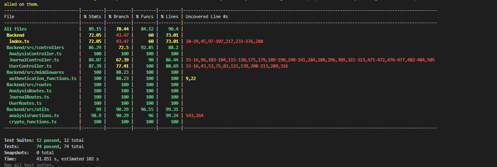
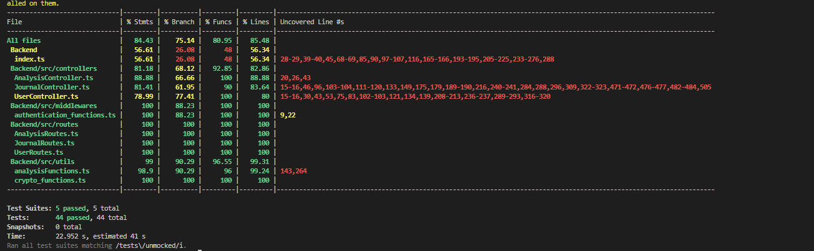

# Example M5: Testing and Code Review

## 1. Change History

| **Change Date**   | **Modified Sections** | **Rationale** |
| ----------------- | --------------------- | ------------- |
| _Nothing to show_ |

---

## 2. Back-end Test Specification: APIs

### 2.1. Locations of Back-end Tests and Instructions to Run Them

#### 2.1.1. Tests (update line numbers)

| **Interface**                 | **Describe Group Location, No Mocks**          | **Describe Group Location, With Mocks**      | **Mocked Components**                          |
|-------------------------------|-----------------------------------------------|-----------------------------------------------|-----------------------------------------------|
| **POST /api/journal**         |[`/Backend/tests/unmocked/journal.unmocked.test.ts#L266`](#) |[`/Backend/tests/mocked/journal.mocked.test.ts#L90`](#)<br>[`/Backend/tests/mocked/journal.llm.mocked.test.ts#L92`](#)| MongoDB, Google Auth Token Validation, OpenAPI Response  |
| **GET /api/journal**          |[`/Backend/tests/unmocked/journal.unmocked.test.ts#L171`](#)|[`/Backend/tests/mocked/journal.mocked.test.ts#L147`](#)| MongoDB Query Operations                      |
| **PUT /api/journal**          |[`/Backend/tests/unmocked/journal.unmocked.test.ts#L362`](#)|[`/Backend/tests/mocked/journal.mocked.test.ts#L177`](#)| Database Update Operations                    |
| **DELETE /api/journal**       |[`/Backend/tests/unmocked/journal.unmocked.test.ts#L405`](#)|[`/Backend/tests/mocked/journal.mocked.test.ts#L198`](#)| MongoDB Query Operations                                       |
| **GET /api/journal/file**          |[`/Backend/tests/unmocked/journal.unmocked.test.ts#L452`](#)|[`/Backend/tests/mocked/journal.mocked.test.ts#L238`](#)| MongoDB Query Operations                   |
| **POST /api/payment-sheet**   |[`/Backend/tests/unmocked/payment.unmocked.test.ts#L57`](#)|[`/Backend/tests/mocked/payment.mocked.test.ts#L68`](#)| Stripe Customers, EphemeralKeys, PaymentIntents|
| **GET /api/analytics**        | [`/Backend/tests/unmocked/analytics.unmocked.test.ts#L258`](#)|[`/Backend/tests/mocked/analytics.mocked.test.ts#L25`](#)| MongoDB Analytics Queries                     |   |
| **POST /webhook**             |[`/Backend/tests/unmocked/webhook.unmocked.test.ts#L56`](#)|[`/Backend/tests/mocked/webhook.mocked.test.ts#L56`](#)| -                                             |
| **GET /api/profile**          |[`/Backend/tests/unmocked/user.unmocked.test.ts#L63`](#)|[`/Backend/tests/mocked/user.mocked.test.ts#L67`](#)| Firebase Admin, MongoDB User Collection       |
| **POST /api/profile**         |[`/Backend/tests/unmocked/user.unmocked.test.ts#L97`](#)|[`/Backend/tests/mocked/user.mocked.test.ts#L98`](#)| Google Auth API, MongoDB Insertions           |
| **GET /api/profile/isPaid**   |[`/Backend/tests/unmocked/user.unmocked.test.ts#L175`](#)|[`/Backend/tests/mocked/user.mocked.test.ts#L215`](#)| -                                             |
| **POST /api/profile/reminder**|[`/Backend/tests/unmocked/user.unmocked.test.ts#L206`](#)|[`/Backend/tests/mocked/user.mocked.test.ts#L177`](#)| MongoDB Update Operations                     |
| **POST /api/profile/fcmtoken**|[`/Backend/tests/unmocked/user.unmocked.test.ts#L246`](#)|[`/Backend/tests/mocked/user.mocked.test.ts#L139`](#)| Firebase Cloud Messaging (FCM)                |
| **POST /api/chat**            |[`/Backend/tests/unmocked/chat.unmocked.test.ts#L50`](#) |[`/Backend/tests/mocked/chat.mocked.test.ts#L80`](#)| Rasa API (via HTTP), message validation          |
| **POST /api/chat**            |[`/Backend/tests/unmocked/chat.unmocked.test.ts#L200`](#) |[`/Backend/tests/mocked/chat.mocked.test.ts#L110`](#)| MongoDB, Rasa Response, Auth Token             |

#### 2.1.2. Commit Hash Where Tests Run

`[Insert Commit SHA here]`

#### 2.1.3. Explanation on How to Run the Tests

1. **Clone the Repository**:

  1. Open your terminal and run to clone:
     ```
     git clone https://github.com/example/your-project.git
     ```
  2. Set up environment variables by 
    export MONGODB_URI=`mongodb://mongo:27017`
    export STRIPE_SECRET=`your_stripe_accuont's_secret_key`
    export OPEN_API_KEY=`valid_open_ai_api_key`
    export GOOGLE_USER_PREFIX= XXX
    export GOOGLE_USER_ID=XXX@gmail.com

    or create a new file called `.env` inside `/Backend` folder, put these variables in .env like this:
    ```
    DB_URI=mongodb://localhost:27017
    PORT=3001
    OPEN_API_KEY=valid_open_ai_api_key
    STRIPE_SECRET=your_stripe_accuont's_secret_key
    GOOGLE_USER_PREFIX=XXX
    GOOGLE_USER_ID=XXX@gmail.com
    ```
  3.  Set up variables for testing by creating a file called `unmocked_data.json` inside `/Backend/tests` folder. Put these information in it like this:
  ```
  {
    "testGoogleToken": "this google token must be valid and corresponds to the google num id you put below",
    "googleNumID": "this field is a series of numbers of your google account numeric id",
    "OPEN_API_KEY": "valid_open_ai_api_key",
    "googleUserPrefix": "XXX",
  }
  ```

  4. Change you working directory to `/Backend`. Run the command:
  ```
    npm test
  ```

2. **...**

### 2.2. GitHub Actions Configuration Location

`/.github/workflows/deploy.yml`

### 2.3. Jest Coverage Report Screenshots With Mocks




For coverage of journal controller, there are some lines that are implemented to support some extra actions of the application that couldn't be fully implemented end-to-end yet and this accounts for a considerable amount of the number of uncovered lines. A small portion of the uncovered lines is becasuse we don't call openapi with tests, we mock valid and invalid outputs for it. And the rest are checks for db to see if the db got values. 

For analysisFunctions, the two uncovered lines are checks within the data structure functions made that are never supposed to be triggered by it's use, but are useful to checking for valid inputs to the functions.

### 2.4. Jest Coverage Report Screenshots Without Mocks



---

## 3. Back-end Test Specification: Tests of Non-Functional Requirements

### 3.1. Test Locations in Git

| **Non-Functional Requirement**  | **Location in Git**                              |
| ------------------------------- | ------------------------------------------------ |
| **Performance (Response Time)** | [`tests/nonfunctional/response_time.test.js`](#) |
| **Encryption of Entries**          | [`tests/nonfunctional/chat_security.test.js`](#) |
| **Usability (Frontend)**        | ['Frontend/app/src/androidTest/java/com/example/cpen321project/Nonfunctional_clicks_test.kt'](#)|

### 3.2. Test Verification and Logs

- **Journal Data Security**
  - **Verification:** This test ensures that journal entries are properly encrypted before being stored in the database. The test creates a sample journal entry through the API and retrieves the stored data directly from MongoDB. The retrieved entry is then checked to confirm that it does not match the plaintext input, indicating successful encryption. Additionally, the system is tested for correct decryption by retrieving the entry to verify that it matches the original input. This guarantees that encryption and decryption mechanisms work as expected and that journal entries remain secure in storage.
  - **Log Output**
    ```
    console.log
    Starting test: Encrypt and Retrieve Journal Entry

      at tests/unmocked/journal.unmocked.test.ts:267:17

      console.log
        Sending POST /api/journal request to create journal entry...

          at tests/unmocked/journal.unmocked.test.ts:269:17

    POST /api/journal 200 74 - 61.322 ms
      console.log
        Received response: 200 {
          activities: {},
          message: 'Existing journal entry updated successfully!'
        }

          at tests/unmocked/journal.unmocked.test.ts:275:17

      console.log
        Fetching stored entry directly from Mongo database...

          at tests/unmocked/journal.unmocked.test.ts:279:17

      console.log
        Checking encryption...

          at tests/unmocked/journal.unmocked.test.ts:283:17

      console.log
        Encryption verified: Stored content does not match original input.

          at tests/unmocked/journal.unmocked.test.ts:286:17

      console.log
        Retrieving journal entry via GET /api/journal ...

          at tests/unmocked/journal.unmocked.test.ts:291:17
          
    GET /api/journal?date=2025-03-11&userID=llcce44%40gmail.com&googleNumID=102768322270580370699 200 4824 - 60.818 ms
      console.log
        Received response: 200 {
          journal: {
            text: 'Testing...',
            media: [
              'data:image/png;base64,iVBORw0KGgoAAAANSUhEUgAAAOEAAA...'
            ]
          }
        }
    ```

- **Performance (Response Time)**

  - **Verification:** This test suite simulates multiple concurrent API calls using Jest along with a load-testing utility to mimic real-world user behavior. The focus is on key endpoints such as user login and study group search to ensure that each call completes within the target response time of 2 seconds under normal load. The test logs capture metrics such as average response time, maximum response time, and error rates. These logs are then analyzed to identify any performance bottlenecks, ensuring the system can handle expected traffic without degradation in user experience.
  - **Log Output**
    ```
    [Placeholder for response time test logs]
    ```


- **Usability (Frontend)**
  - **Verification:** This test simulates user interaction with the journal feature by performing multiple clicks (less than the threshold), including selecting dates, typing journal entries, sending messages, and confirming deletions. The test verifies that each step, from creating, editing and deleting journal entries, functions correctly in the app within 3 clicks as discussed din the requirements. The test also ensures that UI elements such as the chat input field, send button, delete button, and confirmation dialogs are displayed and intractable.
  - **Log Output**

      | **Timestamp**            | **Process ID**   | **Test Suite**  | **Package Name**                  | **Log Level** | **Description**                                                                                          |
      |--------------------------|------------------|-----------------|-----------------------------------|---------------|----------------------------------------------------------------------------------------------------------|
      | 2025-03-17 12:10:59.548  | 7938-7967        | EspressoTest     | com.example.cpen321project        | D             | Starting test: Usability for managing journal                                                              |
      | 2025-03-17 12:10:59.548  | 7938-7967        | EspressoTest     | com.example.cpen321project        | D             | Test for Creating: Clicking on an unhighlighted date, Click 1                                               |
      | 2025-03-17 12:11:02.040  | 7938-7967        | EspressoTest     | com.example.cpen321project        | D             | Checking if chat input is displayed                                                                       |
      | 2025-03-17 12:11:02.083  | 7938-7967        | EspressoTest     | com.example.cpen321project        | D             | Typing start message: Start                                                                                |
      | 2025-03-17 12:11:06.285  | 7938-7967        | EspressoTest     | com.example.cpen321project        | D             | Clicking send chat button. Click 2                                                                         |
      | 2025-03-17 12:11:08.049  | 7938-7967        | EspressoTest     | com.example.cpen321project        | D             | Typing journal entry: I had a good balance between work and fun today. Days like this remind me why balance is so important. |
      | 2025-03-17 12:11:18.738  | 7938-7967        | EspressoTest     | com.example.cpen321project        | D             | Clicking send chat button again. Click 3                                                                   |
      | 2025-03-17 12:11:24.313  | 7938-7967        | EspressoTest     | com.example.cpen321project        | D             | Done in 3 clicks. Clicking back button to entries. Now delete                                               |
      | 2025-03-17 12:11:29.143  | 7938-7967        | EspressoTest     | com.example.cpen321project        | D             | Checking if calendar view is displayed                                                                    |
      | 2025-03-17 12:11:29.168  | 7938-7967        | EspressoTest     | com.example.cpen321project        | D             | Testing: Deleting                                                                                         |
      | 2025-03-17 12:11:30.171  | 7938-7967        | EspressoTest     | com.example.cpen321project        | D             | Clicking on a highlighted date. Click 1                                                                    |
      | 2025-03-17 12:11:32.967  | 7938-7967        | EspressoTest     | com.example.cpen321project        | D             | Checking if delete button is displayed                                                                    |
      | 2025-03-17 12:11:32.975  | 7938-7967        | EspressoTest     | com.example.cpen321project        | D             | Clicking delete button, click 2                                                                            |
      | 2025-03-17 12:11:37.264  | 7938-7967        | EspressoTest     | com.example.cpen321project        | D             | Checking if confirmation dialog is displayed                                                             |
      | 2025-03-17 12:11:38.285  | 7938-7967        | EspressoTest     | com.example.cpen321project        | D             | Clicking Yes to confirm deletion, Click 3                                                                  |
      | 2025-03-17 12:11:42.460  | 7938-7967        | EspressoTest     | com.example.cpen321project        | D             | Testing: Editing                                                                                          |
      | 2025-03-17 12:11:43.461  | 7938-7967        | EspressoTest     | com.example.cpen321project        | D             | Clicking on a highlighted date, Click 1                                                                    |
      | 2025-03-17 12:11:44.879  | 7938-7967        | EspressoTest     | com.example.cpen321project        | D             | Checking if Save Entry button is displayed                                                                |
      | 2025-03-17 12:11:45.504  | 7938-7967        | EspressoTest     | com.example.cpen321project        | D             | Clicking edit button, Click 2                                                                              |
      | 2025-03-17 12:11:47.414  | 7938-7967        | EspressoTest     | com.example.cpen321project        | D             | Typing additional text: . I also played soccer to make my day feel even better                            |
      | 2025-03-17 12:11:54.350  | 7938-7967        | EspressoTest     | com.example.cpen321project        | D             | Clicking Save Entry button, click 3                                                                       |
      | 2025-03-17 12:11:58.373  | 7938-7967        | EspressoTest     | com.example.cpen321project        | D             | Checking if calendar view is displayed                                                                    |


## 4. Front-end Test Specification (For REFERENCE DELETE AFTER)

### 4.1. Location in Git of Front-end Test Suite:

`Frontend/app/src/androidTest/java/com/example/cpen321project`

### 4.2. Tests

- **Use Case: Login**

  - **Expected Behaviors:**
    | **Scenario Steps** | **Test Case Steps** |
    | ------------------ | ------------------- |
    | 1. The user opens “Add Todo Items” screen. | Open “Add Todo Items” screen. |
    | 2. The app shows an input text field and an “Add” button. The add button is disabled. | Check that the text field is present on screen.<br>Check that the button labelled “Add” is present on screen.<br>Check that the “Add” button is disabled. |
    | 3a. The user inputs an ill-formatted string. | Input “_^_^^OQ#$” in the text field. |
    | 3a1. The app displays an error message prompting the user for the expected format. | Check that a dialog is opened with the text: “Please use only alphanumeric characters”. |
    | 3. The user inputs a new item for the list and the add button becomes enabled. | Input “buy milk” in the text field.<br>Check that the button labelled “add” is enabled. |
    | 4. The user presses the “Add” button. | Click the button labelled “add”. |
    | 5. The screen refreshes and the new item is at the bottom of the todo list. | Check that a text box with the text “buy milk” is present on screen.<br>Input “buy chocolate” in the text field.<br>Click the button labelled “add”.<br>Check that two text boxes are present on the screen with “buy milk” on top and “buy chocolate” at the bottom. |
    | 5a. The list exceeds the maximum todo-list size. | Repeat steps 3 to 5 ten times.<br>Check that a dialog is opened with the text: “You have too many items, try completing one first”. |

  - **Test Logs:**
    ```
    [Placeholder for Espresso test execution logs]
    ```

- **Use Case: ...**

  - **Expected Behaviors:**

    | **Scenario Steps** | **Test Case Steps** |
    | ------------------ | ------------------- |
    | ...                | ...                 |

  - **Test Logs:**
    ```
    [Placeholder for Espresso test execution logs]
    ```

- **...**
## 4. Front-end Test Specification

### 4.1. Location in Git of Front-end Test Suite:

`Frontend/app/src/androidTest/java/com/example/cpen321project`

### 4.2. Tests

- **Use Case: User Click on Unhighlighted Create Entry**

  - **Expected Behaviors:**
    
    | **Scenario Steps** | **Test Case Steps** |
    | ------------------ | ------------------- |
    | 1. User clicks on an unhighlighted date. | Click on an unhighlighted date in `calenderrecycleView`. |
    | 2. The chat input field is displayed. | Check that `chatInput` is displayed. |
    | 3. User enters a start message. | Input "Start" in `chatInput`, close keyboard, and click `sendChatButton`. |
    | 4. User enters a journal entry. | Input "I had a good balance between work and fun today. Days like this remind me why balance is so important." in `chatInput`, close keyboard, and click `sendChatButton`. |
    | 5. The entry is saved, and the calendar refreshes. | Click `Backbuttonentries`, check that `calenderrecycleView` is displayed with the date highlighted. |

  - **Test Logs:**

      | Timestamp                | Process ID | Test Suite | Package Name              | Log Level | Description                                     |
      |--------------------------|------------|------------|---------------------------|-----------|-------------------------------------------------|
      | 2025-03-17 11:24:30.240  | 2767-2864  | EspressoTest | com.example.cpen321project  | D         | Clicking on an unhighlighted date              |
      | 2025-03-17 11:24:32.784  | 2767-2864  | EspressoTest | com.example.cpen321project  | D         | Checking if chat input is displayed            |
      | 2025-03-17 11:24:32.818  | 2767-2864  | EspressoTest | com.example.cpen321project  | D         | Typing start message: Start                    |
      | 2025-03-17 11:24:36.887  | 2767-2864  | EspressoTest | com.example.cpen321project  | D         | Clicking send chat button                      |
      | 2025-03-17 11:24:38.679  | 2767-2864  | EspressoTest | com.example.cpen321project  | D         | Typing journal entry: I had a good balance between work and fun today. Days like this remind me why balance is so important. |
      | 2025-03-17 11:24:47.059  | 2767-2864  | EspressoTest | com.example.cpen321project  | D         | Clicking send chat button again                |
      | 2025-03-17 11:24:52.746  | 2767-2864  | EspressoTest | com.example.cpen321project  | D         | Clicking back button to entries                |
      | 2025-03-17 11:24:54.152  | 2767-2864  | EspressoTest | com.example.cpen321project  | D         | Checking if calendar view is displayed         |
      | 2025-03-17 11:24:54.937  | 2767-2864  | EspressoTest | com.example.cpen321project  | D         | Checking if the selected date is highlighted   |
      | 2025-03-17 11:24:55.037  | 2767-2864  | EspressoTest | com.example.cpen321project  | D         | Test A_User_click_on_unhiglighted_create_entry completed successfully   |

- **Use Case: User Click on Highlighted Edit Entry**

  - **Expected Behaviors:**
    
    | **Scenario Steps** | **Test Case Steps** |
    | ------------------ | ------------------- |
    | 1. User clicks on a highlighted date. | Click on a highlighted date in `calenderrecycleView`. |
    | 2. The edit button is displayed. | Check that `Saveentrybutton` is displayed. |
    | 3. User clicks edit and modifies the journal entry. | Click `editbutton`, input ". I also played soccer to make my day feel even better" in `journalEntryInput`, close keyboard, and click `Saveentrybutton`. |
    | 4. The entry is saved, and the calendar refreshes. | Check that `calenderrecycleView` is displayed with the date still highlighted. |

  - **Test Logs:**

      | Timestamp                | Process ID | Test Suite | Package Name              | Log Level | Description                                     |
      |--------------------------|------------|------------|---------------------------|-----------|-------------------------------------------------|
      | 2025-03-17 10:41:30.810  | 31252-31279 | EspressoTest | com.example.cpen321project  | D         | Starting test: B_User_click_on_higlighted_edit_entry |
      | 2025-03-17 10:41:31.813  | 31252-31279 | EspressoTest | com.example.cpen321project  | D         | Clicking on a highlighted date                |
      | 2025-03-17 10:41:33.215  | 31252-31279 | EspressoTest | com.example.cpen321project  | D         | Checking if Save Entry button is displayed     |
      | 2025-03-17 10:41:53.756  | 31252-31279 | EspressoTest | com.example.cpen321project  | D         | Clicking edit button                          |
      | 2025-03-17 10:41:54.782  | 31252-31279 | EspressoTest | com.example.cpen321project  | D         | Typing additional text: . I also played soccer to make my day feel even better |
      | 2025-03-17 10:41:59.951  | 31252-31279 | EspressoTest | com.example.cpen321project  | D         | Clicking Save Entry button                    |
      | 2025-03-17 10:42:02.737  | 31252-31279 | EspressoTest | com.example.cpen321project  | D         | Checking if calendar view is displayed        |
      | 2025-03-17 10:42:02.752  | 31252-31279 | EspressoTest | com.example.cpen321project  | D         | Verifying if the date is still highlighted    |
      | 2025-03-17 10:42:02.768  | 31252-31279 | EspressoTest | com.example.cpen321project  | D         | Test B_User_click_on_higlighted_edit_entry completed successfully |

- **Use Case: User Click on Highlighted Delete Entry**

  - **Expected Behaviors:**
    
    | **Scenario Steps** | **Test Case Steps** |
    | ------------------ | ------------------- |
    | 1. User clicks on a highlighted date. | Click on a highlighted date in `calenderrecycleView`. |
    | 2. The delete button is displayed. | Check that `deletebutton` is displayed. |
    | 3. User clicks delete and confirms. | Click `deletebutton`, verify "Delete Journal Entry" dialog, click "Yes". |
    | 4. The entry is deleted, and the calendar refreshes. | Check that `calenderrecycleView` is displayed, ensuring the date is no longer highlighted. |

  - **Test Logs:**
    
      | Timestamp           | Process ID | Test Suite     | Package Name                     | Log Level | Description                                      |
      |---------------------|------------|---------------|----------------------------------|-----------|--------------------------------------------------|
      | 2025-03-17 10:15:02.584 | 24435-24462 | EspressoTest | com.example.cpen321project | D         | Starting test: C_User_click_on_higlighted_delete_entry |
      | 2025-03-17 10:15:03.585 | 24435-24462 | EspressoTest | com.example.cpen321project | D         | Clicking on a highlighted date                  |
      | 2025-03-17 10:15:05.517 | 24435-24462 | EspressoTest | com.example.cpen321project | D         | Checking if delete button is displayed          |
      | 2025-03-17 10:15:05.751 | 24435-24462 | EspressoTest | com.example.cpen321project | D         | Clicking delete button                         |
      | 2025-03-17 10:15:07.640 | 24435-24462 | EspressoTest | com.example.cpen321project | D         | Checking if confirmation dialog is displayed   |
      | 2025-03-17 10:15:08.864 | 24435-24462 | EspressoTest | com.example.cpen321project | D         | Clicking Yes to confirm deletion               |
      | 2025-03-17 10:15:10.990 | 24435-24462 | EspressoTest | com.example.cpen321project | D         | Verifying if the date is no longer highlighted |
      | 2025-03-17 10:15:11.174 | 24435-24462 | EspressoTest | com.example.cpen321project | D         | Test C_User_click_on_higlighted_delete_entry completed successfully |

- **Use Case: User Clicks Future Date**

  - **Expected Behaviors:**
    
    | **Scenario Steps** | **Test Case Steps** |
    | ------------------ | ------------------- |
    | 1. User navigates to the next month. | Click `Next_month_button`. |
    | 2. User clicks on a future date. | Click on a date in `calenderrecycleView`. |
    | 3. The app displays a toast message. | Verify "Cannot add a journal for future dates!" toast message. |

  - **Test Logs:**

      | Timestamp           | Process ID | Test Suite     | Package Name                     | Log Level | Description                                      |
      |---------------------|------------|---------------|----------------------------------|-----------|--------------------------------------------------|
      | 2025-03-17 10:15:12.770 | 24435-24462 | EspressoTest | com.example.cpen321project | D         | Starting test: D_User_clicks_future_date        |
      | 2025-03-17 10:15:14.186 | 24435-24462 | EspressoTest | com.example.cpen321project | D         | Clicking on a future date                      |
      | 2025-03-17 10:15:15.504 | 24435-24462 | EspressoTest | com.example.cpen321project | D         | Checking if toast message is displayed         |
      | 2025-03-17 10:15:15.509 | 24435-24462 | EspressoTest | com.example.cpen321project | D         | Test D_User_clicks_future_date completed successfully |


- **Use Case: User Cannot Upload Image**

  - **Expected Behaviors:**
    
    | **Scenario Steps** | **Test Case Steps** |
    | ------------------ | ------------------- |
    | 1. User clicks on a date. | Click on a date in `calenderrecycleView`. |
    | 2. User tries to upload an image. | Click `addimageButton`. |
    | 3. The app displays a toast message. | Verify "Upgrade to upload media!" toast message. |

  - **Test Logs:**

      | Timestamp           | Process ID | Test Suite     | Package Name                     | Log Level | Description                                      |
      |---------------------|------------|---------------|----------------------------------|-----------|--------------------------------------------------|
      | 2025-03-17 10:15:17.433 | 24435-24462 | EspressoTest | com.example.cpen321project | D         | Starting test: E_User_cannot_upload_image       |
      | 2025-03-17 10:15:19.197 | 24435-24462 | EspressoTest | com.example.cpen321project | D         | Clicking add image button                      |
      | 2025-03-17 10:15:20.769 | 24435-24462 | EspressoTest | com.example.cpen321project | D         | Checking if upgrade toast message is displayed |
      | 2025-03-17 10:15:20.770 | 24435-24462 | EspressoTest | com.example.cpen321project | D         | Test E_User_cannot_upload_image completed successfully |


- **Use Case: User Exports Journal**

  - **Expected Behaviors:**
    
    | **Scenario Steps** | **Test Case Steps** |
    | ------------------ | ------------------- |
    | 1. User clicks export. | Click `export_button`. |
    | 2. The app displays a confirmation message. | Verify "File URL copied to clipboard!" toast message. |

  - **Test Logs:**

      | Timestamp           | Process ID | Test Suite     | Package Name                     | Log Level | Description                                      |
      |---------------------|------------|---------------|----------------------------------|-----------|--------------------------------------------------|
      | 2025-03-17 10:15:23.259 | 24435-24462 | EspressoTest | com.example.cpen321project | D         | Starting test: F_User_export_journal            |
      | 2025-03-17 10:15:23.368 | 24435-24462 | EspressoTest | com.example.cpen321project | D         | Clicking export button                         |
      | 2025-03-17 10:15:25.153 | 24435-24462 | EspressoTest | com.example.cpen321project | D         | Checking if file copied toast message is displayed |
      | 2025-03-17 10:15:25.159 | 24435-24462 | EspressoTest | com.example.cpen321project | D         | Test F_User_export_journal completed successfully |


- **Use Case: Paid User Uploads an Image (Camera)**

  - **Expected Behaviors:**
    
    | **Scenario Steps** | **Test Case Steps** |
    | ------------------ | ------------------- |
    | 1. User clicks on a date. | Click on a date in `calenderrecycleView`. |
    | 2. User clicks the add image button. | Click `addimageButton`. |
    | 3. Upload media popup appears. | Check that "Upload Media" popup is displayed. |
    | 4. User selects "Take a Photo". | Click "Take a Photo". |
    
  - **Test Logs:**

      | Timestamp                | Process ID | Test Suite | Package Name              | Log Level | Description                                     |
      |--------------------------|------------|------------|---------------------------|-----------|-------------------------------------------------|
      | 2025-03-17 10:34:50.735  | 29605-29633 | EspressoTest | com.example.cpen321project  | D         | Starting test: A_User_Upload_Image_popup_check_camera |
      | 2025-03-17 10:34:50.735  | 29605-29633 | EspressoTest | com.example.cpen321project  | D         | Clicking on date 1 in calendar                |
      | 2025-03-17 10:34:52.978  | 29605-29633 | EspressoTest | com.example.cpen321project  | D         | Checking if add image button is displayed     |
      | 2025-03-17 10:34:54.249  | 29605-29633 | EspressoTest | com.example.cpen321project  | D         | Clicking on add image button                  |
      | 2025-03-17 10:34:54.936  | 29605-29633 | EspressoTest | com.example.cpen321project  | D         | Checking if Upload Media popup is displayed   |
      | 2025-03-17 10:34:54.949  | 29605-29633 | EspressoTest | com.example.cpen321project  | D         | Clicking on Take a Photo option               |
      | 2025-03-17 10:34:55.274  | 29605-29633 | EspressoTest | com.example.cpen321project  | D         | Test A_User_Upload_Image_popup_check_camera completed successfully |

- **Use Case: Paid User Uploads an Image (Gallery)**

  - **Expected Behaviors:**
    
    | **Scenario Steps** | **Test Case Steps** |
    | ------------------ | ------------------- |
    | 1. User clicks on a date. | Click on a date in `calenderrecycleView`. |
    | 2. User clicks the add image button. | Click `addimageButton`. |
    | 3. Upload media popup appears. | Check that "Upload Media" popup is displayed. |
    | 4. User selects "Select from Gallery". | Click "Select from Gallery". |
    
  - **Test Logs:**

      | Timestamp                | Process ID | Test Suite | Package Name              | Log Level | Description                                     |
      |--------------------------|------------|------------|---------------------------|-----------|-------------------------------------------------|
      | 2025-03-17 10:34:56.815  | 29605-29633 | EspressoTest | com.example.cpen321project  | D         | Starting test: B_User_Upload_Image_popup_check_device |
      | 2025-03-17 10:34:56.816  | 29605-29633 | EspressoTest | com.example.cpen321project  | D         | Clicking on date 1 in calendar                |
      | 2025-03-17 10:34:58.551  | 29605-29633 | EspressoTest | com.example.cpen321project  | D         | Checking if add image button is displayed     |
      | 2025-03-17 10:34:59.567  | 29605-29633 | EspressoTest | com.example.cpen321project  | D         | Clicking on add image button                  |
      | 2025-03-17 10:35:00.165  | 29605-29633 | EspressoTest | com.example.cpen321project  | D         | Checking if Upload Media popup is displayed   |
      | 2025-03-17 10:35:00.174  | 29605-29633 | EspressoTest | com.example.cpen321project  | D         | Clicking on Select from Gallery option        |
      | 2025-03-17 10:35:00.739  | 29605-29633 | EspressoTest | com.example.cpen321project  | D         | Test B_User_Upload_Image_popup_check_device completed successfully |


- **Use Case: Paid User Deletes an Image**

  - **Expected Behaviors:**
    
    | **Scenario Steps** | **Test Case Steps** |
    | ------------------ | ------------------- |
    | 1. User clicks on a date with an existing image. | Click on a date in `calenderrecycleView`. |
    | 2. User clicks on the journal image. | Click `journalImageView`. |
    | 3. Delete image popup appears. | Check that "Delete Image" popup is displayed. |
    | 4. User confirms deletion. | Click "Delete". |
    
  - **Test Logs:**

      | Timestamp                | Process ID | Test Suite | Package Name              | Log Level | Description                                     |
      |--------------------------|------------|------------|---------------------------|-----------|-------------------------------------------------|
      | 2025-03-17 10:35:02.147  | 29605-29633 | EspressoTest | com.example.cpen321project  | D         | Starting test: C_User_Deletes_existing_Image_popup_check |
      | 2025-03-17 10:35:02.147  | 29605-29633 | EspressoTest | com.example.cpen321project  | D         | Clicking on date 12 in calendar               |
      | 2025-03-17 10:35:03.508  | 29605-29633 | EspressoTest | com.example.cpen321project  | D         | Checking if add image button is displayed     |
      | 2025-03-17 10:35:04.521  | 29605-29633 | EspressoTest | com.example.cpen321project  | D         | Clicking on journal image view                |
      | 2025-03-17 10:35:05.282  | 29605-29633 | EspressoTest | com.example.cpen321project  | D         | Checking if Delete Image popup is displayed   |
      | 2025-03-17 10:35:06.293  | 29605-29633 | EspressoTest | com.example.cpen321project  | D         | Clicking Delete button                        |
      | 2025-03-17 10:35:06.643  | 29605-29633 | EspressoTest | com.example.cpen321project  | D         | Test C_User_Deletes_existing_Image_popup_check completed successfully |

- **Use Case: User Checks Analytics for Emotions**

  - **Expected Behaviors:**
    
    | **Scenario Steps** | **Test Case Steps** |
    | ------------------ | ------------------- |
    | 1. User clicks on analytics button. | Click `analytics_button`. |
    | 2. Emotion filter button is displayed. | Check that `emotionFilterButton` is displayed. |
    | 3. User opens emotion filter. | Click `emotionFilterButton`. |
    | 4. User selects "Joy" and "Sadness". | Click "Joy", then click "Sadness". |
    | 5. User applies the filter. | Click "Apply". |
    | 6. The analytics chart updates. | Check that `analyticsChart` is displayed. |
    
  - **Test Logs:**
      | Timestamp            | Process ID | Thread ID | Tag          | Package                               | Log Level | Message |
      |----------------------|-----------|-----------|-------------|--------------------------------------|-----------|---------------------------------------------------------------|
      | 2025-03-17 10:03:05.619 | 22690     | 22779     | EspressoTest | com.example.cpen321project | D         | Starting test: User_Analytics_check_emotions |
      | 2025-03-17 10:03:05.619 | 22690     | 22779     | EspressoTest | com.example.cpen321project | D         | Clicking on Analytics button |
      | 2025-03-17 10:03:07.069 | 22690     | 22779     | EspressoTest | com.example.cpen321project | D         | Waiting for Analytics screen to load |
      | 2025-03-17 10:03:17.070 | 22690     | 22779     | EspressoTest | com.example.cpen321project | D         | Checking if emotion filter button is displayed |
      | 2025-03-17 10:03:17.092 | 22690     | 22779     | EspressoTest | com.example.cpen321project | D         | Clicking on emotion filter button |
      | 2025-03-17 10:03:18.052 | 22690     | 22779     | EspressoTest | com.example.cpen321project | D         | Selecting emotions: Joy and Sadness |
      | 2025-03-17 10:03:18.761 | 22690     | 22779     | EspressoTest | com.example.cpen321project | D         | Clicking Apply button |
      | 2025-03-17 10:03:19.285 | 22690     | 22779     | EspressoTest | com.example.cpen321project | D         | Checking if analytics chart is displayed |
      | 2025-03-17 10:03:19.308 | 22690     | 22779     | EspressoTest | com.example.cpen321project | D         | Test User_Analytics_check_emotions completed successfully |


- **Use Case: User Checks Analytics for Activities**

  - **Expected Behaviors:**
    
    | **Scenario Steps** | **Test Case Steps** |
    | ------------------ | ------------------- |
    | 1. User clicks on analytics button. | Click `analytics_button`. |
    | 2. Activity filter button is displayed. | Check that `activityfilterButton` is displayed. |
    | 3. User opens activity filter. | Click `activityfilterButton`. |
    | 4. User selects "Sleep" and "Sadness". | Click "Sleep", then click "Sadness". |
    | 5. User applies the filter. | Click "Apply". |
    | 6. The activities chart updates. | Check that `activities_chart` is displayed. |
    
  - **Test Logs:**
      | Timestamp            | Process ID | Thread ID | Tag          | Package                               | Log Level | Message |
      |----------------------|-----------|-----------|-------------|--------------------------------------|-----------|---------------------------------------------------------------|
      | 2025-03-17 10:03:21.658 | 22690     | 22779     | EspressoTest | com.example.cpen321project | D         | Starting test: User_Analytics_check_activities |
      | 2025-03-17 10:03:21.658 | 22690     | 22779     | EspressoTest | com.example.cpen321project | D         | Clicking on Analytics button |
      | 2025-03-17 10:03:22.459 | 22690     | 22779     | EspressoTest | com.example.cpen321project | D         | Waiting for Analytics screen to load |
      | 2025-03-17 10:03:42.462 | 22690     | 22779     | EspressoTest | com.example.cpen321project | D         | Checking if activity filter button is displayed |
      | 2025-03-17 10:03:42.477 | 22690     | 22779     | EspressoTest | com.example.cpen321project | D         | Clicking on activity filter button |
      | 2025-03-17 10:03:44.314 | 22690     | 22779     | EspressoTest | com.example.cpen321project | D         | Selecting activities: Sleep and Walk |
      | 2025-03-17 10:03:45.486 | 22690     | 22779     | EspressoTest | com.example.cpen321project | D         | Clicking Apply button |
      | 2025-03-17 10:03:46.931 | 22690     | 22779     | EspressoTest | com.example.cpen321project | D         | Checking if activities chart is displayed |
      | 2025-03-17 10:03:46.945 | 22690     | 22779     | EspressoTest | com.example.cpen321project | D         | Test User_Analytics_check_activities completed successfully |


- **Use Case: Update Reminder Settings**

  - **Expected Behaviors:**
    
    | **Scenario Steps** | **Test Case Steps** |
    | ------------------ | ------------------- |
    |1. The user clicks on the profile icon.|Click on the profile button.|
    |2. The system displays the user profile and the current reminder settings. (For new users, all weekdays are set to none, and the displayed time matches the device's current time.)| Check that the profile screen is displayed. Verify that the displayed time matches the device's current time if the user has not set a reminder before.|
    | 3. The user selects a weekday and sets a reminder time.|Click on a weekday button to select it. Use the time picker to set a reminder time.|
    | 4. The user clicks "Save Settings".|Click the "Save Settings" button.|
    |5. The system displays a success message confirming the update.|Check that a toast message with text "Reminder updated successfully!" is displayed.|
    |6. The system ensures that the selected weekday remains highlighted after saving.|Check that the selected weekday button remains highlighted after saving.
    |7. The system sends a notification at the selected time.|Wait for the selected time.Check that a notification with text "Journal Reminder" appears.|
    
  - **Test Logs:**
    | Timestamp            | Process ID | Thread ID | Tag          | Package                               | Log Level | Message |
    |----------------------|-----------|-----------|-------------|--------------------------------------|-----------|---------------------------------------------------------------|
    | 2025-03-17 12:49:41.897 | 18933     | 18965     | EspressoTest | com.example.cpen321project | D         | Launching main activity |
    | 2025-03-17 12:49:42.364 | 18933     | 18965     | EspressoTest | com.example.cpen321project | D         | Starting test: Reminder Settings |
    | 2025-03-17 12:49:44.365 | 18933     | 18965     | EspressoTest | com.example.cpen321project | D         | Clicking on profile button |
    | 2025-03-17 12:49:47.033 | 18933     | 18965     | EspressoTest | com.example.cpen321project | D         | Verifying current reminder settings |
    | 2025-03-17 12:49:52.076 | 18933     | 18965     | EspressoTest | com.example.cpen321project | D         | Selecting weekday for reminder |
    | 2025-03-17 12:49:52.351 | 18933     | 18965     | EspressoTest | com.example.cpen321project | D         | Setting reminder time to 12:50 |
    | 2025-03-17 12:49:52.369 | 18933     | 18965     | EspressoTest | com.example.cpen321project | D         | Saving reminder settings |
    | 2025-03-17 12:49:53.660 | 18933     | 18965     | EspressoTest | com.example.cpen321project | D         | Verifying success toast message |
    | 2025-03-17 12:49:53.663 | 18933     | 18965     | EspressoTest | com.example.cpen321project | D         | Verifying selected weekday remains highlighted |
    | 2025-03-17 12:49:53.669 | 18933     | 18965     | EspressoTest | com.example.cpen321project | D         | Waiting for notification... |
    | 2025-03-17 12:50:56.272 | 18933     | 18965     | EspressoTest | com.example.cpen321project | D         | Notification verified successfully |
    | 2025-03-17 12:50:58.434 | 18933     | 18965     | EspressoTest | com.example.cpen321project | D         | Releasing intents |


- **Use Case: Update Activities Tracking**

  - **Expected Behaviors:**
    
    | **Scenario Steps** | **Test Case Steps** |
    | ------------------ | ------------------- |
    |1. The user clicks on the profile icon.| Click on the profile button.|
    |2. The system displays the user profile and current activity tracking settings.| Check that the activity list is displayed.|
    |3. The user adds a new activity.| Click the "Add Activity" button. Enter "Running" in the activity name field. Enter "30" in the value field. Select "Minutes" from the dropdown. Click "Add".|
    |4. The system updates the activity list with the new entry.| Verify that the activity list contains "Running".|
    |5. The user deletes an activity from the list.|Long press the "Running" activity.Click "Delete".|
    | 6. The system updates the activity list and removes the entry.|Verify that the activity "Running" is no longer in the list.|
    |7. The user clicks "Save Settings".|Click the "Save Settings" button.|
    |8. The system displays a success message confirming the update.|Check that a toast message with text "Profile updated successfully!" is displayed.|
    
  - **Test Logs:**
    | Timestamp            | Process ID | Thread ID | Tag          | Package                               | Log Level | Message |
    |----------------------|-----------|-----------|-------------|--------------------------------------|-----------|---------------------------------------------------------------|
    | 2025-03-17 12:51:09.765 | 18933     | 18965     | EspressoTest | com.example.cpen321project | D         | Launching main activity |
    | 2025-03-17 12:51:09.877 | 18933     | 18965     | EspressoTest | com.example.cpen321project | D         | Starting test: Activity List Management |
    | 2025-03-17 12:51:11.881 | 18933     | 18965     | EspressoTest | com.example.cpen321project | D         | Clicking on profile button |
    | 2025-03-17 12:51:14.368 | 18933     | 18965     | EspressoTest | com.example.cpen321project | D         | Original activity count: 1 |
    | 2025-03-17 12:51:14.368 | 18933     | 18965     | EspressoTest | com.example.cpen321project | D         | Adding new activity: Running |
    | 2025-03-17 12:51:18.064 | 18933     | 18965     | EspressoTest | com.example.cpen321project | D         | Selecting 'Minutes' from dropdown |
    | 2025-03-17 12:51:19.738 | 18933     | 18965     | EspressoTest | com.example.cpen321project | D         | Confirming addition |
    | 2025-03-17 12:51:22.061 | 18933     | 18965     | EspressoTest | com.example.cpen321project | D         | Verifying new activity exists in the list |
    | 2025-03-17 12:51:22.079 | 18933     | 18965     | EspressoTest | com.example.cpen321project | D         | Deleting activity: Running |
    | 2025-03-17 12:51:23.663 | 18933     | 18965     | EspressoTest | com.example.cpen321project | D         | Saving settings |
    | 2025-03-17 12:51:24.959 | 18933     | 18965     | EspressoTest | com.example.cpen321project | D         | Verifying success toast message |
    | 2025-03-17 12:51:24.961 | 18933     | 18965     | EspressoTest | com.example.cpen321project | D         | Test completed successfully |
    | 2025-03-17 12:51:24.962 | 18933     | 18965     | EspressoTest | com.example.cpen321project | D         | Releasing intents |

      


- **Use Case: Update Preferred Name**

  - **Expected Behaviors:**
    
    | **Scenario Steps** | **Test Case Steps** |
    | ------------------ | ------------------- |
    |1. The user clicks on the profile icon.|Click on the profile button.|
    |2. The system displays the user profile and the preferred name field.| Check that the preferred name field is visible.|
    |3. The user enters a new preferred name.| Clear the existing text in the preferred name field. Type "John Doe" into the field.|
    |4. The user clicks "Save Settings".| Click the "Save Settings" button.|
    |5. The system displays a success message confirming the update.| Check that a toast message with text "Profile updated successfully!" is displayed.|
    |6. The user navigates back and reopens the profile.|Click the back button. Click the profile button again. |
    |7. The system retains the updated preferred name.|Verify that the preferred name field contains "John Doe".|
    
  - **Test Logs:**
      | Timestamp            | Process ID | Thread ID | Tag          | Package                               | Log Level | Message |
    |----------------------|-----------|-----------|-------------|--------------------------------------|-----------|---------------------------------------------------------------|
    | 2025-03-17 12:50:58.616 | 18933     | 18965     | EspressoTest | com.example.cpen321project | D         | Launching main activity |
    | 2025-03-17 12:50:58.764 | 18933     | 18965     | EspressoTest | com.example.cpen321project | D         | Starting test: Update Preferred Name |
    | 2025-03-17 12:51:00.768 | 18933     | 18965     | EspressoTest | com.example.cpen321project | D         | Clicking on profile button |
    | 2025-03-17 12:51:03.299 | 18933     | 18965     | EspressoTest | com.example.cpen321project | D         | Entering new preferred name: John Doe |
    | 2025-03-17 12:51:04.958 | 18933     | 18965     | EspressoTest | com.example.cpen321project | D         | Saving name update |
    | 2025-03-17 12:51:06.338 | 18933     | 18965     | EspressoTest | com.example.cpen321project | D         | Verifying success toast message |
    | 2025-03-17 12:51:06.340 | 18933     | 18965     | EspressoTest | com.example.cpen321project | D         | Navigating back and reopening profile to verify change |
    | 2025-03-17 12:51:09.644 | 18933     | 18965     | EspressoTest | com.example.cpen321project | D         | Verifying preferred name is updated |
    | 2025-03-17 12:51:09.648 | 18933     | 18965     | EspressoTest | com.example.cpen321project | D         | Test completed successfully |
    | 2025-03-17 12:51:09.648 | 18933     | 18965     | EspressoTest | com.example.cpen321project | D         | Releasing intents |


- **Use Case: Paid vs. Non-Paid User Profile Access**

  - **Expected Behaviors:**
    
    For non-paid users:
    | **Scenario Steps** | **Test Case Steps** |
    | ------------------ | ------------------- |
    |Non-paid users:||
    |1. The user logs in as a non-paid user.|Set authentication state for a non-paid user. Launch the app.|
    |2. The user clicks on the profile button.|Click the profile button.|
    |3. The system displays an upgrade button.| Verify that the "Upgrade" button is visible.|
    |Paid User:| Click the "Save Settings" button.|
    |1. The user logs in as a paid user.| Set authentication state for a paid user. Launch the app.|
    |2. The user clicks on the profile button.|Click the profile button.|
    |3. The system does not show an upgrade button.|Verify that the "Upgrade" button is not visible.|
    
  - **Test Logs:**

  **Non-Paid user Test:**
    | Timestamp            | Process ID | Thread ID | Tag          | Package                               | Log Level | Message |
  |----------------------|-----------|-----------|-------------|--------------------------------------|-----------|---------------------------------------------------------------|
  | 2025-03-17 13:05:31.626 | 21077     | 21108     | EspressoTest | com.example.cpen321project | D         | Launching main activity |
  | 2025-03-17 13:05:32.160 | 21077     | 21108     | EspressoTest | com.example.cpen321project | D         | Starting test: View Non-Paid User Profile |
  | 2025-03-17 13:05:34.946 | 21077     | 21108     | EspressoTest | com.example.cpen321project | D         | Waiting for user profile to load... |
  | 2025-03-17 13:05:36.946 | 21077     | 21108     | EspressoTest | com.example.cpen321project | D         | Checking if there is an upgrade button... |
  | 2025-03-17 13:05:36.951 | 21077     | 21108     | EspressoTest | com.example.cpen321project | D         | Test completed successfully |

  **Paid user Test**
    | Timestamp            | Process ID | Thread ID | Tag          | Package                               | Log Level | Message |
  |----------------------|-----------|-----------|-------------|--------------------------------------|-----------|---------------------------------------------------------------|
  | 2025-03-17 13:06:17.986 | 21389     | 21422     | EspressoTest | com.example.cpen321project | D         | Launching main activity |
  | 2025-03-17 13:06:18.443 | 21389     | 21422     | EspressoTest | com.example.cpen321project | D         | Starting test: View Paid User Profile |
  | 2025-03-17 13:06:21.193 | 21389     | 21422     | EspressoTest | com.example.cpen321project | D         | Waiting for user profile to load... |
  | 2025-03-17 13:06:23.197 | 21389     | 21422     | EspressoTest | com.example.cpen321project | D         | Checking if there is no upgrade button... |
  | 2025-03-17 13:06:23.210 | 21389     | 21422     | EspressoTest | com.example.cpen321project | D         | Test completed successfully |


---

## 5. Automated Code Review Results

### 5.1. Commit Hash Where Codacy Ran

`[Insert Commit SHA here]`

### 5.2. Unfixed Issues per Codacy Category

_(Placeholder for screenshots of Codacy’s Category Breakdown table in Overview)_

### 5.3. Unfixed Issues per Codacy Code Pattern

_(Placeholder for screenshots of Codacy’s Issues page)_

### 5.4. Justifications for Unfixed Issues

- **Code Pattern: [Usage of Deprecated Modules](#)**

  1. **Issue**

     - **Location in Git:** [`src/services/chatService.js#L31`](#)
     - **Justification:** ...

  2. ...

- ...
